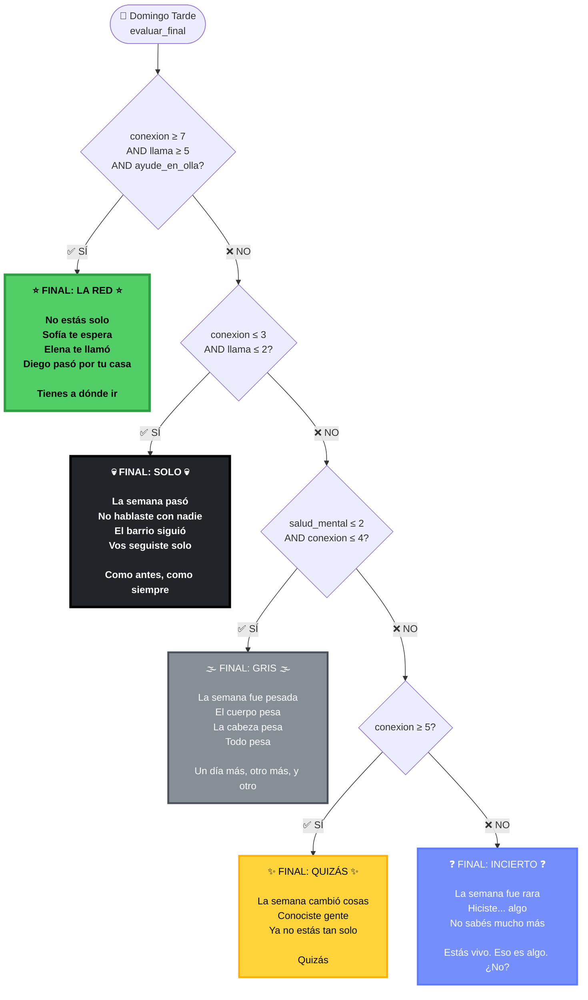
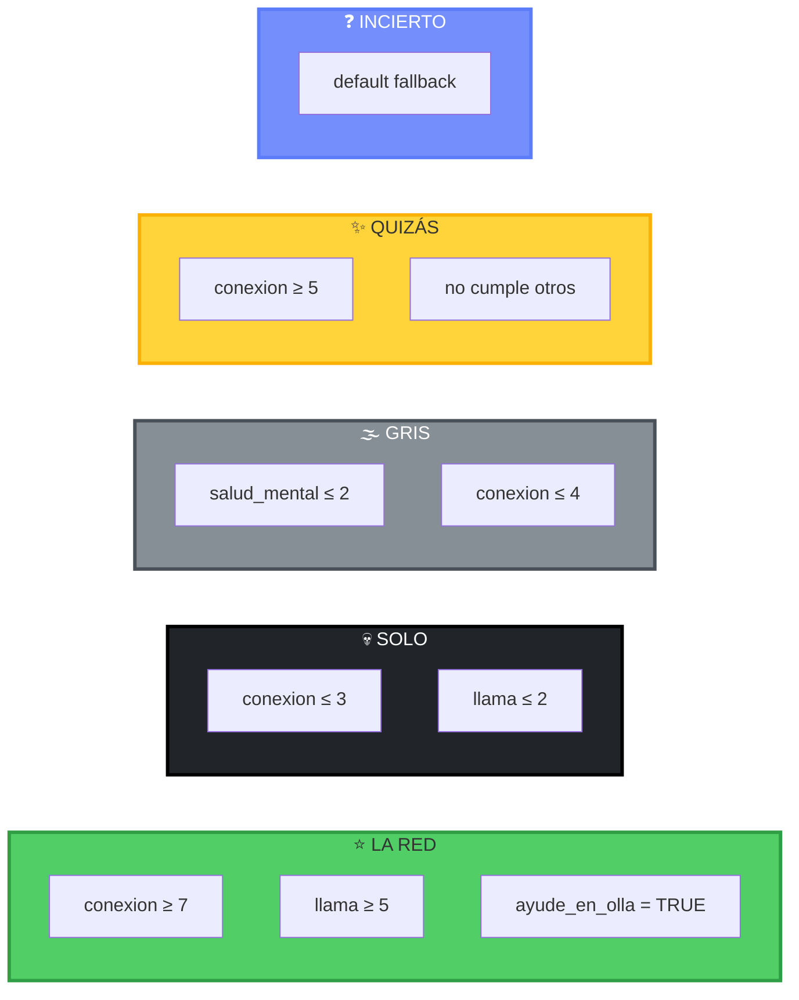
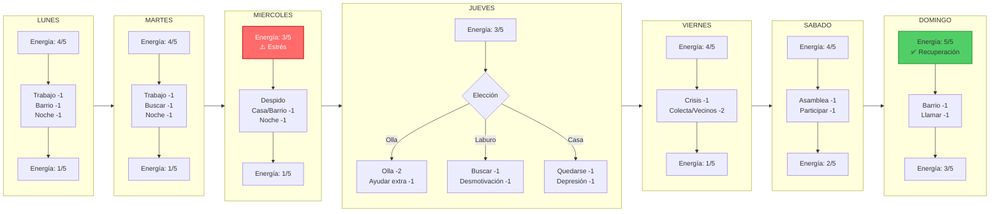
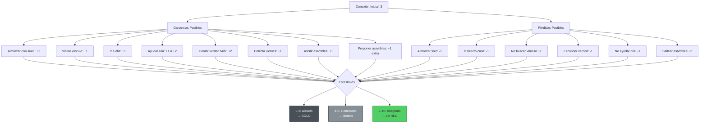
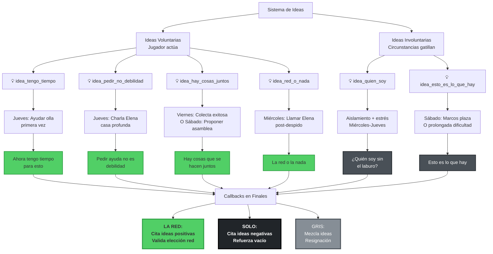
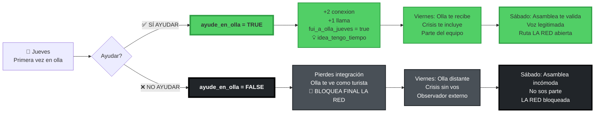
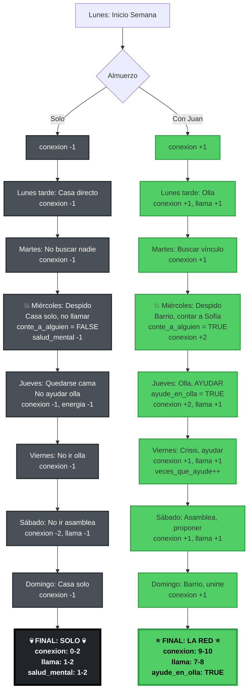

# Un Día Más - Flowcharts Interactivos

> Visualizaciones Mermaid de rutas narrativas, mecánicas y NPCs

---

## Índice Rápido

1. [Semana Completa - Timeline](#semana-completa---timeline)
2. [Rutas Críticas a Finales](#rutas-críticas-a-finales)
3. [Miércoles - Turning Point](#miércoles---turning-point-detallado)
4. [Sistema de Finales](#sistema-de-finales)
5. [NPCs - Arcos Narrativos](#npcs---arcos-narrativos)
6. [Economía de Recursos](#economía-de-recursos)
7. [Sistema de Ideas](#sistema-de-ideas)

---

## Semana Completa - Timeline

```mermaid
gantt
    title Un Día Más - Estructura Temporal
    dateFormat X
    axisFormat %a

    section Trabajo
    Trabajando          :active, 1, 2
    Despido            :crit, 3, 3
    Sin trabajo        :done, 4, 7

    section Olla Popular
    Primera visita (opcional) :milestone, 1, 1
    Crisis revelada    :2, 3
    Ayudar (crítico)   :crit, 4, 4
    Crisis máxima      :crit, 5, 5
    Asamblea          :milestone, 6, 6

    section Conexión
    Lunes: Baseline    :1, 1
    Martes: Tensión    :2, 2
    Miér: Turning Point :crit, 3, 3
    Jue-Vie: Build     :4, 5
    Sáb: Clímax        :crit, 6, 6
    Dom: Evaluación    :milestone, 7, 7
```



---

## Rutas Críticas a Finales

### Vista General

```mermaid
flowchart TD
    START([🔷 Lunes: Inicio]) --> L_CHOICES{Almuerzo + Barrio}

    L_CHOICES -->|Social| L_CONN[conexion +2]
    L_CHOICES -->|Neutral| L_NEUT[conexion +0]
    L_CHOICES -->|Aislado| L_ISO[conexion -2]

    L_CONN --> MARTES
    L_NEUT --> MARTES
    L_ISO --> MARTES

    MARTES[🔷 Martes: Tensión] --> M_CHOICE{Buscar vínculo?}
    M_CHOICE -->|Sí| M_CONN[+1 conexion]
    M_CHOICE -->|No| M_ISO[-1 conexion]

    M_CONN --> WEDS
    M_ISO --> WEDS

    WEDS[💥 Miércoles: DESPIDO 💥]:::critical

    WEDS --> W_CHOICE{Respuesta}

    W_CHOICE -->|Casa sola| W_HOME[Aislamiento]
    W_CHOICE -->|Caminar| W_WALK[Contemplar]
    W_CHOICE -->|Barrio+Contar| W_TELL[+2 conexion<br/>conte_a_alguien=true]:::good

    W_HOME --> THURS
    W_WALK --> THURS
    W_TELL --> THURS

    THURS[🔷 Jueves: Sin Trabajo] --> TH_CHOICE{Acción}

    TH_CHOICE -->|Olla+AYUDAR| TH_HELP[ayude_en_olla=TRUE<br/>+2 conexion, +1 llama]:::good
    TH_CHOICE -->|Buscar laburo| TH_JOB[-1 dignidad, -1 energía]
    TH_CHOICE -->|Quedarse| TH_STAY[-1 conexion, -1 energía]:::bad

    TH_HELP --> FRIDAY
    TH_JOB --> FRIDAY
    TH_STAY --> FRIDAY

    FRIDAY[🔷 Viernes: Crisis] --> F_CHOICE{Ayudar crisis?}

    F_CHOICE -->|SÍ| F_HELP[+conexion, +llama<br/>veces_que_ayude++]:::good
    F_CHOICE -->|NO| F_SKIP[-conexion, olla sufre]:::bad

    F_HELP --> SATURDAY
    F_SKIP --> SATURDAY

    SATURDAY[🔷 Sábado: Asamblea] --> S_MARCOS{Llamar Marcos?}

    S_MARCOS -->|SÍ| S_REVEAL[💥 Revela despido<br/>+idea]:::special
    S_MARCOS -->|NO| S_SKIP[Miss único momento]

    S_REVEAL --> S_ASSEMBLY
    S_SKIP --> S_ASSEMBLY

    S_ASSEMBLY{Ir a asamblea?}

    S_ASSEMBLY -->|NO| S_NO[-2 conexion, -1 llama]:::bad
    S_ASSEMBLY -->|SÍ+PROPONER| S_YES[+1 conexion, +1 llama]:::good
    S_ASSEMBLY -->|SÍ+ESCUCHAR| S_LISTEN[neutral]

    S_NO --> SUNDAY
    S_YES --> SUNDAY
    S_LISTEN --> SUNDAY

    SUNDAY[🔷 Domingo: Reflexión] --> EVAL

    EVAL{Evaluación}:::critical

    EVAL -->|conexion≥7 AND llama≥5<br/>AND ayude_en_olla| FINAL_RED[⭐ LA RED ⭐]:::ending_best
    EVAL -->|conexion≤3 AND llama≤2| FINAL_SOLO[💀 SOLO 💀]:::ending_worst
    EVAL -->|salud_mental≤2 AND<br/>conexion≤4| FINAL_GRIS[🌫️ GRIS 🌫️]:::ending_bad
    EVAL -->|conexion≥5| FINAL_QUIZ[✨ QUIZÁS ✨]:::ending_good
    EVAL -->|default| FINAL_INC[❓ INCIERTO ❓]:::ending_neutral

    classDef critical fill:#ff6b6b,stroke:#c92a2a,stroke-width:3px,color:#fff
    classDef good fill:#51cf66,stroke:#2f9e44,stroke-width:2px
    classDef bad fill:#495057,stroke:#212529,stroke-width:2px,color:#fff
    classDef special fill:#ffd43b,stroke:#fab005,stroke-width:2px
    classDef ending_best fill:#51cf66,stroke:#2f9e44,stroke-width:4px,color:#000
    classDef ending_worst fill:#212529,stroke:#000,stroke-width:4px,color:#fff
    classDef ending_bad fill:#868e96,stroke:#495057,stroke-width:3px,color:#fff
    classDef ending_good fill:#ffd43b,stroke:#fab005,stroke-width:3px,color:#000
    classDef ending_neutral fill:#748ffc,stroke:#5c7cfa,stroke-width:3px,color:#fff
```



---

## Miércoles - Turning Point Detallado

### La Decisión Más Importante

```mermaid
flowchart TD
    FIRE[💥 11:00 AM<br/>DESPIDO<br/>Salís de RRHH]:::critical

    FIRE --> CHOICE{¿Qué hacer?}

    %% OPCIÓN A: CASA
    CHOICE -->|IR A CASA| HOME[Sentarse en casa vacía<br/>Mediodía solo]
    HOME --> HOME_CHOICE{Llamar a alguien?}

    HOME_CHOICE -->|NO LLAMAR| HOME_ALONE[conte_a_alguien = FALSE<br/>-1 salud_mental<br/>AISLAMIENTO TOTAL]:::worst

    HOME_CHOICE -->|LLAMAR ELENA| HOME_ELENA[Elena cuenta 2002<br/>💡 idea_red_o_nada<br/>conte_a_alguien = TRUE<br/>+1 conexion]:::good

    HOME_CHOICE -->|LLAMAR DIEGO| HOME_DIEGO[Diego solidario<br/>conte_a_alguien = TRUE<br/>+1 conexion]:::good

    HOME_CHOICE -->|LLAMAR MARCOS| HOME_MARCOS[No contesta<br/>"Visto" solamente]:::bad

    %% OPCIÓN B: CAMINAR
    CHOICE -->|CAMINAR SIN RUMBO| WALK[Aimless walk<br/>Ver homeless en plaza]
    WALK --> WALK_REFLECT[Metáfora destitución<br/>Contemplación solitaria<br/>-1 salud_mental]:::neutral

    %% OPCIÓN C: BARRIO (MEJOR RUTA)
    CHOICE -->|IR AL BARRIO| BARRIO[Caminar al barrio<br/>Ver movimiento normal]
    BARRIO --> SEE_SOFIA[Cruzarte con Sofía]

    SEE_SOFIA --> SOFIA_CHOICE{¿Contar verdad?}

    SOFIA_CHOICE -->|CONTAR VERDAD| TELL[💚 MEJOR DECISIÓN 💚]:::best
    TELL --> TELL_1[conte_a_alguien = TRUE]
    TELL_1 --> TELL_2[+2 conexion]
    TELL_2 --> TELL_3[sofia_relacion +1]
    TELL_3 --> SOFIA_REACT{Sofía reacciona}

    SOFIA_REACT --> SOFIA_OFFER[Ofrece ayuda olla<br/>"Si querés ayudar..."]
    SOFIA_OFFER --> CRISIS_REVEAL{Preguntar sobre olla?}

    CRISIS_REVEAL -->|SÍ PREGUNTAR| CRISIS_YES[Sofía: "Andamos mal"<br/>olla_en_crisis = TRUE<br/>+1 llama si aceptás ayudar]:::good

    CRISIS_REVEAL -->|NO PREGUNTAR| CRISIS_NO[Enterarte el viernes]

    SOFIA_CHOICE -->|ESCONDER/MENTIR| HIDE[conte_a_alguien = FALSE<br/>-1 conexion<br/>Sofía nota algo raro]:::bad

    %% RESULTADOS
    HOME_ALONE --> RESULT_WORST[😢 Peor resultado<br/>Aislamiento total<br/>Nadie sabe]:::worst
    HOME_ELENA --> RESULT_OK[😐 Resultado OK<br/>Alguien sabe<br/>Pero sin acción]:::neutral
    HOME_DIEGO --> RESULT_OK
    HOME_MARCOS --> RESULT_BAD[😞 Resultado malo<br/>Intentaste, falló<br/>Aún aislado]:::bad
    WALK_REFLECT --> RESULT_BAD
    HIDE --> RESULT_BAD
    CRISIS_YES --> RESULT_BEST[😊 Mejor resultado<br/>Red activada<br/>Crisis conocida<br/>Ruta LA RED abierta]:::best
    CRISIS_NO --> RESULT_GOOD[🙂 Resultado bueno<br/>Red activada<br/>Crisis descubierta después]:::good

    classDef critical fill:#ff6b6b,stroke:#c92a2a,stroke-width:4px,color:#fff,font-weight:bold
    classDef best fill:#51cf66,stroke:#2f9e44,stroke-width:3px,font-weight:bold
    classDef good fill:#51cf66,stroke:#2f9e44,stroke-width:2px
    classDef neutral fill:#868e96,stroke:#495057,stroke-width:2px,color:#fff
    classDef bad fill:#495057,stroke:#212529,stroke-width:2px,color:#fff
    classDef worst fill:#212529,stroke:#000,stroke-width:3px,color:#fff,font-weight:bold
```

---

## Sistema de Finales

### Árbol de Evaluación



### Requisitos de Finales



---

## NPCs - Arcos Narrativos

### Sofía (Olla Manager)

```mermaid
flowchart TD
    START([Sofía - Lunes<br/>sofia_estado: activa<br/>sofia_relacion: 2])

    START --> L_CONTACT{Lunes: Contacto?}

    L_CONTACT -->|Visita casa/olla| L_YES[+1 relacion<br/>Ve que te interesa]
    L_CONTACT -->|No contacto| L_NO[Estado: activa<br/>pero distante]

    L_YES --> TUESDAY
    L_NO --> TUESDAY

    TUESDAY[Martes: Buscarla?] --> T_CONTACT{Contacto?}
    T_CONTACT -->|Sí| T_YES[+1 relacion<br/>Preocupada por despidos]
    T_CONTACT -->|No| T_NO[Distancia crece]

    T_YES --> WEDS
    T_NO --> WEDS

    WEDS[💥 Miércoles: Tu despido] --> W_TELL{Le contás?}

    W_TELL -->|SÍ| W_TELL_YES[💚 +2 relacion<br/>sofia_estado: receptiva<br/>Ofrece ayuda olla<br/>Revela crisis]:::good

    W_TELL -->|NO| W_TELL_NO[Estado: distante<br/>No sabe tu situación]:::bad

    W_TELL_YES --> THURSDAY
    W_TELL_NO --> THURSDAY

    THURSDAY[Jueves: Olla] --> TH_HELP{Ayudás?}

    TH_HELP -->|SÍ AYUDAR| TH_YES[sofia_relacion +2<br/>sofia_estado: agradecida<br/>Te integra al equipo]:::good

    TH_HELP -->|NO| TH_NO[sofia_estado: agotada<br/>Esperaba ayuda]:::bad

    TH_YES --> FRIDAY
    TH_NO --> FRIDAY

    FRIDAY[🔥 Viernes: CRISIS] --> F_CRISIS{Crisis meeting}

    F_CRISIS --> F_HELP{Ayudás?}

    F_HELP -->|SÍ| F_YES[sofia_estado: esperanzada<br/>+1 relacion<br/>"Gracias por estar"]:::good

    F_HELP -->|NO| F_NO[sofia_estado: quebrando<br/>Olla apenas sobrevive<br/>"No pudimos solos"]:::bad

    F_YES --> SATURDAY
    F_NO --> SATURDAY

    SATURDAY[Sábado: Asamblea] --> S_ATTEND{Asistís?}

    S_ATTEND -->|SÍ| S_YES[Sofía facilita<br/>Te ve como parte<br/>sofia_estado: activa]:::good

    S_ATTEND -->|NO| S_NO[Sofía decepcionada<br/>sofia_estado: ausente]:::bad

    S_YES --> SUNDAY
    S_NO --> SUNDAY

    SUNDAY[Domingo: Final] --> RESULT{Estado final}

    RESULT -->|Si ayudaste siempre| RESULT_BEST[sofia_estado: esperanzada<br/>sofia_relacion: 8-10<br/>"Sos parte del equipo"]:::best

    RESULT -->|Si ayudaste a veces| RESULT_OK[sofia_estado: cansada<br/>sofia_relacion: 5-7<br/>"Gracias por intentar"]:::neutral

    RESULT -->|Si no ayudaste| RESULT_WORST[sofia_estado: quemada<br/>sofia_relacion: 1-3<br/>"Necesitábamos más"]:::worst

    classDef good fill:#51cf66,stroke:#2f9e44,stroke-width:2px
    classDef bad fill:#495057,stroke:#212529,stroke-width:2px,color:#fff
    classDef best fill:#51cf66,stroke:#2f9e44,stroke-width:3px,font-weight:bold
    classDef neutral fill:#868e96,stroke:#495057,stroke-width:2px,color:#fff
    classDef worst fill:#212529,stroke:#000,stroke-width:3px,color:#fff,font-weight:bold
```

### Marcos (Burned-out Militant)

```mermaid
flowchart TD
    START([Marcos - Lunes<br/>marcos_estado: aislado<br/>marcos_relacion: 1]):::isolated

    START --> L_CALL[Lunes: Intentar contacto]
    L_CALL --> L_RESULT[❌ No contesta<br/>"Visto"]:::bad

    L_RESULT --> TUESDAY

    TUESDAY[Martes: Buscar] --> T_RESULT[❌ No está<br/>Ausente total]:::bad

    T_RESULT --> WEDS

    WEDS[Miércoles: Llamar] --> W_RESULT[❌ No contesta<br/>Silencio]:::bad

    W_RESULT --> THURSDAY

    THURSDAY[Jueves: Intentar] --> TH_RESULT[❌ Nada<br/>Aislamiento continúa]:::bad

    TH_RESULT --> FRIDAY

    FRIDAY[Viernes: Llamar] --> F_RESULT[❌ No contesta<br/>Patrón persiste]:::bad

    F_RESULT --> SATURDAY

    SATURDAY[🔥 Sábado: ÚNICO DÍA]:::critical

    SATURDAY --> S_CALL{Llamar en la mañana?}

    S_CALL -->|❌ NO LLAMAR| S_NO[❌ PIERDES ÚNICA CHANCE<br/>Marcos sigue aislado<br/>No hay reconexión posible]:::worst

    S_CALL -->|✅ SÍ LLAMAR| S_YES[✅ ¡CONTESTA!<br/>"Dale. Plaza. Una hora."]:::best

    S_YES --> PLAZA[Plaza encuentro]

    PLAZA --> REVEAL[💥 REVEAL SHOCK 💥<br/>"Me echaron."<br/>"Hace dos semanas."<br/>"No le dije a nadie."]:::critical

    REVEAL --> TALK[Charla precariedad<br/>Ambos despedidos<br/>Solidaridad mutua<br/>marcos_relacion +2]:::good

    TALK --> IDEA[💡 Unlock idea:<br/>"Esto es lo que hay"]:::neutral

    IDEA --> INVITE{Invitar a asamblea?}

    INVITE -->|✅ SÍ INVITAR| INV_YES["Puede ser."<br/>marcos_estado: considerando]:::good

    INVITE -->|❌ NO INVITAR| INV_NO[Se queda en casa<br/>marcos_estado: aislado]:::bad

    INV_YES --> ASSEMBLY{¿Vas a asamblea?}

    ASSEMBLY -->|✅ SÍ VAS| ASM_YES[💚 Marcos aparece<br/>Se sienta atrás<br/>marcos_estado: mirando<br/>"Pequeño paso"]:::best

    ASSEMBLY -->|❌ NO VAS| ASM_NO[Marcos no va<br/>Tu ausencia confirma su aislamiento<br/>marcos_estado: perdido]:::worst

    INV_NO --> SUNDAY
    S_NO --> SUNDAY
    ASM_YES --> SUNDAY
    ASM_NO --> SUNDAY

    SUNDAY[Domingo: Final] --> RESULT{Estado final}

    RESULT -->|Si reconectaste + asamblea| RESULT_BEST[marcos_estado: mirando<br/>marcos_relacion: 5-6<br/>"Hay algo, quizás"]:::best

    RESULT -->|Si reconectaste pero sin asamblea| RESULT_OK[marcos_estado: dudando<br/>marcos_relacion: 3-4<br/>"No sé"]:::neutral

    RESULT -->|Si no llamaste sábado| RESULT_WORST[marcos_estado: perdido<br/>marcos_relacion: 1<br/>Aislamiento total]:::worst

    classDef isolated fill:#495057,stroke:#212529,stroke-width:2px,color:#fff
    classDef bad fill:#495057,stroke:#212529,stroke-width:2px,color:#fff
    classDef critical fill:#ff6b6b,stroke:#c92a2a,stroke-width:3px,color:#fff,font-weight:bold
    classDef best fill:#51cf66,stroke:#2f9e44,stroke-width:3px,font-weight:bold
    classDef good fill:#51cf66,stroke:#2f9e44,stroke-width:2px
    classDef neutral fill:#868e96,stroke:#495057,stroke-width:2px,color:#fff
    classDef worst fill:#212529,stroke:#000,stroke-width:3px,color:#fff,font-weight:bold
```

---

## Economía de Recursos

### Flujo de Energía Semanal



### Conexión: Ganancia y Pérdida



---

## Sistema de Ideas

### Ideas Desbloqueables



### Árbol de Unlock de Ideas

```mermaid
graph TD
    MONDAY[Lunes]
    TUESDAY[Martes]
    WEDNESDAY[💥 Miércoles]
    THURSDAY[Jueves]
    FRIDAY[Viernes]
    SATURDAY[Sábado]

    WEDNESDAY -->|Llamar Elena| IDEA1[💡 idea_red_o_nada<br/>"La red o la nada"]:::idea

    THURSDAY -->|Ayudar olla| IDEA2[💡 idea_tengo_tiempo<br/>"Ahora tengo tiempo"]:::idea

    THURSDAY -->|Charla Elena casa| IDEA3[💡 idea_pedir_no_debilidad<br/>"Pedir no es debilidad"]:::idea

    THURSDAY -->|Aislamiento| IDEA4[💡 idea_quien_soy<br/>"¿Quién soy sin laburo?"]:::idea_bad

    FRIDAY -->|Colecta exitosa| IDEA5[💡 idea_hay_cosas_juntos<br/>"Se hacen juntos"]:::idea

    SATURDAY -->|Plaza Marcos| IDEA6[💡 idea_esto_es_lo_que_hay<br/>"Esto es lo que hay"]:::idea_bad

    SATURDAY -->|Proponer asamblea| IDEA5

    MONDAY --> TUESDAY
    TUESDAY --> WEDNESDAY
    WEDNESDAY --> THURSDAY
    THURSDAY --> FRIDAY
    FRIDAY --> SATURDAY

    classDef idea fill:#51cf66,stroke:#2f9e44,stroke-width:2px
    classDef idea_bad fill:#495057,stroke:#212529,stroke-width:2px,color:#fff
```

---

## Decisiones Críticas - Impacto Visual

### Jueves: ayude_en_olla (GATE para LA RED)



---

## Comparación: Ruta Aislamiento vs. Ruta Conexión



---

## Uso de estos Flowcharts

### En GitHub/GitLab
Los flowcharts Mermaid se renderizan automáticamente en archivos `.md`.

### En VS Code
Instalar extensión: **Markdown Preview Mermaid Support**

### Exportar como Imagen
1. Copiar código Mermaid
2. Ir a https://mermaid.live/
3. Pegar código
4. Exportar como PNG/SVG

### Editar
Sintaxis Mermaid: https://mermaid.js.org/

---

**Generado**: 2026-01-19
**Para**: Un Día Más - Prototype v0.8
**By**: Claude Code Analysis

