# Un Día Más - Mapa Narrativo Completo

> Análisis exhaustivo de la estructura, rutas, decisiones y mecánicas del juego

---

## 📋 Índice

1. [Visión General](#visión-general)
2. [Estructura de los 7 Días](#estructura-de-los-7-días)
3. [Flowchart de Rutas Críticas](#flowchart-de-rutas-críticas)
4. [Todos los Finales](#todos-los-finales)
5. [Sistema de Dados](#sistema-de-dados)
6. [Variables de Estado](#variables-de-estado)
7. [NPCs y Relaciones](#npcs-y-relaciones)
8. [Decisiones Críticas](#decisiones-críticas)
9. [Economía de Recursos](#economía-de-recursos)
10. [Sistema de Ideas](#sistema-de-ideas)

---

## Visión General

**Un Día Más** es un juego narrativo sobre **7 días** en la vida de un trabajador uruguayo que pierde su empleo el miércoles. La pregunta central: **¿Te aislás o te conectás?**

### Estructura Temporal

```
LUNES ─────► MARTES ─────► MIÉRCOLES ─────► JUEVES ─────► VIERNES ─────► SÁBADO ─────► DOMINGO
  │              │              │                │              │              │              │
Trabajo      Tensión        DESPIDO         Primera      Crisis         Asamblea      Reflexión
Normal       Laboral        11 AM           Día Sin      Olla           Colectiva     → FINAL
                                           Trabajo       Popular
```

### Mecánicas Core

| Mecánica | Rango | Impacto | Game Over |
|----------|-------|---------|-----------|
| **Energía** | 0-5 | Limita acciones diarias | ❌ No |
| **Conexión** | 0-10 | Integración comunitaria, acceso a finales, **death spiral si <= 1** | ⚠️ Indirecto (vía llama) |
| **Llama** | 0-10 | Esperanza colectiva, tono de finales | ✅ **Sí (= 0)** → final SIN LLAMA |
| **Dignidad** | 0-10 | Autoestima, resistencia a humillación, **death spiral si <= 2** | ⚠️ Indirecto (vía salud_mental) |
| **Inercia** | 0-10 | Resistencia al cambio, **death spiral si >= 8** | ✅ **Sí (= 10)** → final APAGADO |

**⚠️ IMPORTANTE**: El juego ahora puede terminar ANTES del domingo si salud_mental o llama llegan a 0.

---

## Estructura de los 7 Días

### 🔷 LUNES - "Normalidad Amenazada"

**Energía inicial**: 4/5 | **tiene_laburo**: true

```
DESPERTAR
  ↓
CASA (café, rutina)
  ↓
BONDI → [d6 roll] → 1 = llegás tarde (-dignidad)
  ↓
TRABAJO
  ├─ Mañana: Juan comparte rumores piso 4
  ├─ ALMUERZO: ⚠️ DECISIÓN CRÍTICA
  │   ├─ Comer con Juan (+conexion)
  │   ├─ Comer solo (-conexion)
  │   └─ Saltear (-dignidad)
  ├─ Reunión: "Reestructuración" anunciada
  └─ Tarde: Tensión
  ↓
BONDI (regreso)
  ↓
BARRIO: ⚠️ DECISIÓN CRÍTICA
  ├─ Ir directo casa (-conexion)
  ├─ Visitar vínculo (+conexion, -1 energía)
  ├─ Ir a kiosco
  └─ Ir a OLLA (+conexion, +llama, -1 energía)
  ↓
CASA (noche)
  ├─ Cocinar (-1 energía)
  ├─ Comer rápido
  ├─ Llamar a alguien (+conexion si atienden)
  └─ Ver tele
  ↓
FRAGMENTO NOCTURNO (perspectiva vínculo)
```

**Decisiones que importan**:
- Almorzar con Juan vs. solo → afecta conexion_inicial
- Ir a olla vs. casa → primer contacto con comunidad
- Estado juan_relacion → habilita llamada viernes

---

### 🔷 MARTES - "Tensión Creciente"

**Energía inicial**: 4/5 | **tiene_laburo**: true

```
DESPERTAR (más tensión)
  ↓
CASA
  ↓
BONDI (escena sobre despidos)
  ↓
TRABAJO
  ├─ Ambiente raro
  ├─ Jefe te evita
  ├─ RRHH entra/sale
  └─ CITACIÓN (ominosa)
  ↓
BONDI (regreso tenso)
  ↓
BARRIO: ⚠️ DECISIÓN
  ├─ Ir directo casa (-conexion)
  └─ Buscar vínculo (+conexion, -1 energía)
      ├─ Sofía → en olla cerrando
      ├─ Elena → en vereda
      ├─ Diego → en depósito
      └─ Marcos → no contesta (aislado)
  ↓
CASA (noche ansiosa)
  ↓
FRAGMENTO (vínculo preocupado por despidos)
```

**Decisiones que importan**:
- Buscar vínculo → fortalece relación antes del despido
- Estado marcos_relacion → aún no alcanzable (aislado)

---

### 🔷 MIÉRCOLES - "EL DESPIDO" ⚠️ TURNING POINT

**Energía inicial**: 3/5 (estrés redujo) | **tiene_laburo**: true → **false (11 AM)**

```
DESPERTAR (ansiedad)
  ↓
CASA (no hay apetito)
  ↓
TRABAJO
  ↓
11:00 AM → CITACIÓN RRHH
  ↓
💥 DESPIDO 💥
  ├─ "Unipersonal"
  ├─ Sin indemnización
  └─ 3 meses de runway
  ↓
Salir de la oficina
  ↓
⚠️⚠️⚠️ DECISIÓN MÁS CRÍTICA DEL JUEGO ⚠️⚠️⚠️
  ├─ IR A CASA (miercoles_casa)
  │   ├─ Sentarse en casa vacía al mediodía
  │   └─ OPCIÓN: Llamar a alguien
  │       ├─ ELENA → Cuenta historia 2002
  │       │   └─ 💡 Unlock: idea_red_o_nada
  │       ├─ DIEGO → Solidaridad
  │       └─ MARCOS → No contesta
  │   └─ conte_a_alguien = true/false
  │
  ├─ CAMINAR (miercoles_caminar)
  │   └─ Ver homeless, metáfora destitución
  │
  └─ IR AL BARRIO (miercoles_barrio) ⭐ RUTA CONEXIÓN
      ├─ Ver a Sofía
      └─ DECISIÓN: Contar verdad vs. Evitar
          ├─ CONTAR VERDAD (+conexion x2)
          │   ├─ conte_a_alguien = true
          │   ├─ Sofía ofrece ayuda olla
          │   ├─ "¿Qué pasa con olla?" → olla_en_crisis = true
          │   └─ Aceptar ayudar (+llama)
          └─ EVITAR (-conexion)
              └─ conte_a_alguien = false
  ↓
CASA (cena/ansiedad)
  ↓
FRAGMENTO NOCTURNO
  ├─ Si contaste a Sofía → ella preocupada por números
  ├─ Si contaste a Diego → él teme ser el siguiente
  └─ Si contaste a Elena → ella recordando 2002, va a llamar mañana
```

**Variables clave afectadas**:
- `tiene_laburo = false` (permanente)
- `conte_a_alguien` → afecta toda la semana
- `olla_en_crisis` → habilita escenas viernes
- `sofia_relacion`, `elena_relacion`, `diego_relacion` → aumentan si contactás

---

### 🔷 JUEVES - "Primer Día Sin Trabajo"

**Energía inicial**: 3/5 | **tiene_laburo**: false

```
DESPERTAR (sin alarma)
  ↓
CASA
  └─ DECISIÓN:
      ├─ Despertarse temprano (+dignidad)
      └─ Quedarse en cama (-dignidad, -1 energía)
  ↓
⚠️ DECISIÓN MATUTINA ⚠️
  ├─ BUSCAR LABURO
  │   ├─ Navegar sitios
  │   ├─ Mandar CVs
  │   └─ (-dignidad, -1 energía)
  │
  ├─ IR AL BARRIO
  │   ├─ Caminar casual
  │   └─ IR A OLLA ⭐⭐⭐ ESCENA PRINCIPAL
  │       ├─ Ver Sofía cocinando
  │       ├─ DECISIÓN: Ayudar vs. Solo mirar
  │       │   ├─ AYUDAR (+conexion x2, +llama)
  │       │   │   ├─ ayude_en_olla = true
  │       │   │   ├─ fui_a_olla_jueves = true
  │       │   │   ├─ 💡 Unlock: idea_tengo_tiempo
  │       │   │   ├─ Pelar papas con Elena
  │       │   │   └─ Servir comida (7 PM)
  │       │   └─ SOLO MIRAR → te vas
  │       └─ O ESCAPAR → buscar vínculo
  │
  └─ QUEDARSE EN CASA
      └─ (-conexion, -1 energía, aislamiento)
  ↓
VISITAR VÍNCULO (si elegiste barrio)
  ├─ SOFÍA → en olla (ver arriba)
  ├─ ELENA → su casa, charla profunda
  │   └─ 💡 Unlock: idea_pedir_no_debilidad
  ├─ DIEGO → caminar juntos, miedos compartidos
  └─ MARCOS → aún no contesta
  ↓
CASA (noche)
  ↓
FRAGMENTO
  └─ Depende de si ayudaste en olla
```

**Decisiones críticas**:
- `ayude_en_olla` → **BLOQUEA FINAL "LA RED" si false**
- `fui_a_olla_jueves` → habilita escenas viernes
- Ideas unlocked → cambian interpretación de finales

---

### 🔷 VIERNES - "Crisis de la Olla"

**Energía inicial**: 4/5 | **tiene_laburo**: false

```
DESPERTAR
  ↓
CASA
  ↓
⚠️ DECISIÓN MATUTINA ⚠️
  ├─ IR A OLLA TEMPRANO (+llama)
  │   ↓
  │   REUNIÓN DE CRISIS 🔥
  │   ├─ Sofía: "No hay plata para hoy"
  │   ├─ 30 personas esperando comida
  │   └─ ⚠️ PROPONER SOLUCIÓN
  │       ├─ Proponer colecta callejera
  │       ├─ Proponer puerta a puerta
  │       └─ Quedarse callado
  │   ↓
  │   ⚠️ AYUDAR O NO ⚠️
  │   ├─ AYUDAR CON COLECTA
  │   │   ├─ Ir a calle con Diego
  │   │   ├─ Pedir plata (-dignidad, +conexion)
  │   │   ├─ [d6 >= 4] → colecta exitosa (+llama)
  │   │   ├─ veces_que_ayude++
  │   │   └─ 💡 Unlock: idea_hay_cosas_juntos
  │   │
  │   ├─ AYUDAR CON VECINOS
  │   │   ├─ Puerta a puerta con Elena
  │   │   ├─ Elena enseña "cómo pedir"
  │   │   ├─ Recolectar comida
  │   │   ├─ veces_que_ayude++
  │   │   └─ 💡 Unlock: idea_hay_cosas_juntos
  │   │
  │   └─ NO AYUDAR
  │       ├─ Te vas (-conexion)
  │       └─ Olla apenas sobrevive
  │   ↓
  │   TARDE: COCINAR/PREPARAR (si ayudaste)
  │   └─ 7 PM: Servir a comunidad
  │
  ├─ BUSCAR LABURO
  │   └─ (-dignidad, -1 energía)
  │
  └─ CAMINAR BARRIO
      └─ Pasar por olla, preguntarte qué pasó
  ↓
NOCHE
  └─ Si juan_relacion >= 4:
      └─ Juan llama para ver cómo estás (+conexion)
  ↓
FRAGMENTO
  └─ Comunidad evaluando si olla funcionó
```

**Decisiones críticas**:
- Ayudar colecta/vecinos → fortalece ayude_en_olla
- `veces_que_ayude` → afecta tono assembly
- Idea "hay_cosas_juntos" → crítica para finales

---

### 🔷 SÁBADO - "La Asamblea"

**Energía inicial**: 4/5 | **tiene_laburo**: false

```
DESPERTAR
  ↓
CASA
  ↓
⚠️ DECISIÓN MATUTINA ⚠️
  ├─ LLAMAR A ALGUIEN
  │   ├─ MARCOS ⭐⭐⭐ ÚNICO DÍA QUE CONTESTA
  │   │   ├─ "Dale. Plaza. Una hora."
  │   │   ├─ IR A PLAZA
  │   │   ├─ Marcos llega
  │   │   ├─ 💥 REVELA: "Me echaron." 💥
  │   │   ├─ Charla sobre precariedad compartida
  │   │   ├─ 💡 Unlock: idea_esto_es_lo_que_hay
  │   │   └─ Invitarlo a asamblea (puede aceptar)
  │   │
  │   └─ FAMILIA
  │       └─ Contar o no sobre despido
  │
  ├─ CAMINAR BARRIO
  │   └─ Ver gente reuniéndose para asamblea
  │
  └─ QUEDARSE EN CASA
      └─ (-conexion, -llama)
  ↓
5 PM: ASAMBLEA EN OLLA 🔥🔥🔥
  ↓
  ⚠️⚠️ ASISTIR O NO ⚠️⚠️
  ├─ NO IR (quedarse casa)
  │   ├─ -conexion x2
  │   ├─ -llama
  │   └─ Aislamiento total
  │
  └─ IR A ASAMBLEA ⭐ CLÍMAX COLECTIVO
      ├─ olla_asamblea_inicio
      ├─ Sofía facilita
      ├─ Elena participa
      ├─ Grupo discute soluciones
      │
      └─ ⚠️ TU PARTICIPACIÓN ⚠️
          ├─ HABLAR sobre tu situación (+dignidad)
          ├─ ESCUCHAR a otros (neutral)
          └─ PROPONER acción grande (+dignidad, +llama)
              ├─ Festival solidario
              ├─ Red de ayuda mutua
              └─ 💡 Strengthen: idea_hay_cosas_juntos
      ↓
      Si invitaste a Marcos:
      └─ Marcos aparece, se sienta atrás (mirando)
          └─ marcos_estado = mirando (pequeño paso)
      ↓
      CIERRE ASAMBLEA
      └─ +llama si participaste activamente
  ↓
NOCHE
  ↓
FRAGMENTO
  └─ Todos procesando asamblea, esperanza o derrota
```

**Decisiones críticas**:
- Llamar Marcos → única chance de reconectarlo
- Asistir asamblea → **CRÍTICO para finales**
- Proponer → maximiza llama y dignidad

---

### 🔷 DOMINGO - "Reflexión y Final"

**Energía inicial**: 5/5 | **tiene_laburo**: false

```
DESPERTAR (recuperado)
  ↓
CASA
  ↓
⚠️ DECISIÓN MATUTINA ⚠️
  ├─ PENSAR (quedarse casa)
  │   └─ Reflexionar sobre la semana (-conexion)
  │
  ├─ CAMINAR BARRIO
  │   ├─ Ver energía de sábado continuar
  │   └─ Ver grupo_olla reunido
  │       ├─ UNIRTE (+conexion)
  │       └─ PASAR DE LARGO (-conexion)
  │
  └─ LLAMAR VÍNCULO
      ├─ Sofía → charla sobre planes olla
      ├─ Elena → charla sobre esperanza/supervivencia
      ├─ Diego → check-in mutuo
      └─ Marcos → raramente contesta
  ↓
TARDE: Contemplación estado
  ↓
NOCHE: domingo_noche
  ├─ Resumen de acciones semana
  ├─ Revisar todas las ideas internalizadas
  └─ Evaluación final → evaluar_final
      ↓
      ⚠️⚠️⚠️ FINALES ⚠️⚠️⚠️
```

---

## Flowchart de Rutas Críticas

```mermaid
graph TD
    START[Lunes: Trabajando] --> L1{Almuerzo}
    L1 -->|Con Juan| L2A[+conexion]
    L1 -->|Solo| L2B[-conexion]

    L2A --> L3{Tarde: Barrio}
    L2B --> L3

    L3 -->|Ir a Olla| L4A[+llama +conexion]
    L3 -->|Ir a casa| L4B[-conexion]

    L4A --> MARTES[Martes: Tensión]
    L4B --> MARTES

    MARTES --> M1{Buscar vínculo?}
    M1 -->|Sí| M2A[+conexion]
    M1 -->|No| M2B[Aislado]

    M2A --> MIERCOLES
    M2B --> MIERCOLES

    MIERCOLES[💥 Miércoles 11AM: DESPIDO 💥]

    MIERCOLES --> W1{Qué hacer?}

    W1 -->|Casa sola| W2A[conte_a_alguien=false]
    W1 -->|Caminar| W2B[Contemplar]
    W1 -->|Barrio → Sofía| W2C{Contar verdad?}

    W2C -->|Sí| W3A[conte_a_alguien=true<br/>olla_en_crisis=true<br/>+conexion x2]
    W2C -->|No| W3B[-conexion<br/>aislamiento]

    W2A --> JUEVES
    W2B --> JUEVES
    W3A --> JUEVES[Jueves: Primer día sin trabajo]
    W3B --> JUEVES

    JUEVES --> J1{Qué hacer?}

    J1 -->|Buscar laburo| J2A[-dignidad<br/>-energía]
    J1 -->|Quedarse casa| J2B[-conexion<br/>-energía]
    J1 -->|Ir a Olla| J3{Ayudar?}

    J3 -->|SÍ AYUDAR| J4A[ayude_en_olla=TRUE<br/>+conexion x2<br/>+llama<br/>💡 idea_tengo_tiempo]
    J3 -->|Solo mirar| J4B[Te vas]

    J2A --> VIERNES
    J2B --> VIERNES
    J4A --> VIERNES[Viernes: Crisis Olla]
    J4B --> VIERNES

    VIERNES --> V1{Crisis: Ayudar?}

    V1 -->|Proponer + Ayudar| V2A[+llama +conexion<br/>veces_que_ayude++<br/>💡 idea_hay_cosas_juntos]
    V1 -->|No ayudar| V2B[-conexion<br/>Olla apenas sobrevive]

    V2A --> SABADO[Sábado: Asamblea]
    V2B --> SABADO

    SABADO --> S1{Llamar Marcos?}
    S1 -->|Sí| S2A[💥 Marcos revela despido<br/>Invitar asamblea]
    S1 -->|No| S2B[Skip]

    S2A --> S3{Ir a Asamblea?}
    S2B --> S3

    S3 -->|NO IR| S4A[-conexion x2<br/>-llama<br/>AISLAMIENTO TOTAL]
    S3 -->|IR + PROPONER| S4B[+llama +dignidad<br/>Marcos aparece]
    S3 -->|IR + ESCUCHAR| S4C[Neutral]

    S4A --> DOMINGO[Domingo: Reflexión]
    S4B --> DOMINGO
    S4C --> DOMINGO

    DOMINGO --> D1[Evaluar Final]

    D1 --> EVAL{Evaluación}

    EVAL -->|conexion >= 7<br/>llama >= 5<br/>ayude_en_olla=true| F1[⭐ FINAL: LA RED ⭐<br/>No estás solo<br/>La comunidad te sostiene]

    EVAL -->|conexion <= 3<br/>llama <= 2| F2[💀 FINAL: SOLO 💀<br/>Aislamiento total<br/>Como antes, como siempre]

    EVAL -->|salud_mental <= 2<br/>conexion <= 4| F3[🌫️ FINAL: GRIS 🌫️<br/>Burnout mental<br/>Sobrevivir día a día]

    EVAL -->|conexion >= 5| F4[✨ FINAL: QUIZÁS ✨<br/>Conexiones hechas<br/>Posibilidad abierta]

    EVAL -->|default| F5[❓ FINAL: INCIERTO ❓<br/>Estado ambiguo<br/>En la niebla]

    style MIERCOLES fill:#ff6b6b,stroke:#c92a2a,stroke-width:3px,color:#fff
    style F1 fill:#51cf66,stroke:#2f9e44,stroke-width:3px,color:#000
    style F2 fill:#212529,stroke:#495057,stroke-width:3px,color:#fff
    style F3 fill:#868e96,stroke:#495057,stroke-width:3px,color:#fff
    style F4 fill:#ffd43b,stroke:#fab005,stroke-width:3px,color:#000
    style F5 fill:#748ffc,stroke:#5c7cfa,stroke-width:3px,color:#fff
    style J4A fill:#51cf66,stroke:#2f9e44,stroke-width:2px
    style V2A fill:#51cf66,stroke:#2f9e44,stroke-width:2px
    style S4B fill:#51cf66,stroke:#2f9e44,stroke-width:2px
```



---

## Todos los Finales

### ⚠️ GAME OVER TEMPRANO (Lunes-Sábado)

**IMPORTANTE**: El juego ahora puede terminar ANTES del domingo si se cumplen condiciones críticas.

#### Chequeos en Cada Transición Nocturna

Al final de **cada día** (lunes→martes, martes→miércoles, etc.), el juego verifica:

```ink
=== transicion_XXX_YYY ===

// 1. COLAPSO MENTAL INDIVIDUAL (prioridad máxima)
{inercia >= 10:
    -> final_apagado
}

// 2. DESTRUCCIÓN TEJIDO SOCIAL (colapso colectivo)
{llama <= 0:
    -> final_sin_llama
}

// Si no se cumple, continúa al siguiente día
-> siguiente_dia_amanecer
```

### Evaluación Final (domingo_tarde)

**Si llegaste al domingo**, el juego evalúa en **orden de prioridad**:

```ink
=== evaluar_final ===

// 1. COLAPSO MENTAL (por si llegaste al domingo con inercia = 10)
{inercia >= 10:
    -> final_apagado
}

// 2. COLAPSO COLECTIVO (por si llegaste al domingo con llama = 0)
{llama <= 0:
    -> final_sin_llama
}

// 3. FINAL OCULTO (requiere perfección)
{conexion >= 9 && llama >= 8 && veces_que_ayude >= 3 && participe_asamblea && marcos_vino_a_asamblea && sofia_relacion >= 4 && elena_relacion >= 4 && tiene_todas_ideas():
    -> final_la_llama
}

// 4. MEJOR FINAL (requiere mucho pero no perfección)
{conexion >= 7 && llama >= 5 && ayude_en_olla:
    -> final_red
}

// 5. PEOR FINAL (aislamiento total)
{conexion <= 3 && llama <= 2:
    -> final_solo
}

// 6. BURNOUT (salud mental crítica)
{salud_mental <= 2 && conexion <= 4:
    -> final_gris
}

// 7. ESPERANZA (conexión suficiente)
{conexion >= 5:
    -> final_quizas
}

// 8. DEFAULT (ambiguo)
-> final_incierto
```

---

### 💀 FINAL 0A: APAGADO (Game Over Temprano - Colapso Mental)

**Tipo**: GAME OVER TEMPRANO (puede pasar lunes-sábado)

**Triggers**:
- `inercia >= 10` al final de cualquier día

**Narrativa Fisher**:
```
Pantalla negra. 3:47 AM.
...
```

**Tono**: Crítica estructural. Mark Fisher. Inercia total. Zombificación.

**Cómo llegar**:
- Inercia inicial: 5/10
- Necesitas ganar 5 puntos
- Triggers: despido (+1), llegada tarde (+1), reunión RRHH (+1), encuentros con Juan (+1 cada uno), fragmentos oscuros (+1)
- **Recuperación**: `disminuir_inercia()` solo ocurre en momentos de conexión profunda o éxito crítico.

**Logro**: "Realismo Capitalista" - Alcanzar inercia = 10

---

### 🔥 FINAL 0B: SIN LLAMA (Game Over Temprano - Destrucción Tejido Social)

**Tipo**: GAME OVER TEMPRANO (puede pasar lunes-sábado)

**Triggers**:
- `llama <= 0` al final de cualquier día

**Narrativa**:
```
El barrio está en silencio.
No el silencio de la noche.
El silencio de la rendición.

La olla cerró.
Sofía se rindió: "¿Para qué?"
Elena ya no habla del 2002: "Era otra época."
Diego dejó de buscar: "No hay nada que hacer."

Marcos tenía razón desde el principio.
No hay llama. Nunca la hubo.

El tejido social no se rompe de golpe.
Se deshilacha.
Persona por persona.
Día por día.

Hasta que no queda nada.

Y reconstruirlo toma generaciones.
No días. No semanas.
Generaciones.

{idea_red_o_nada:
    La red o la nada.
    Elegiste la nada.
    Sin querer. Sin darte cuenta.
    Pero la elegiste.
}

# FIN - "El tejido social se destruyó"
```

**Tono**: Colapso colectivo irreversible. No es depresión individual, es muerte comunitaria.

**Cómo llegar**:
- Llama inicial: 5/10
- Necesitas perder 6 puntos
- Triggers: olla colapsa (-2), saltear asamblea (-1), fragmentos oscuros de conexion <= 1 (-1 por noche)
- Run aislacionista extrema: No ir a olla, no ayudar, no participar en asamblea
- Fragmentos oscuros aceleran la caída

**Diferencia con SOLO**: SOLO es aislamiento personal (llegás al domingo, sobrevivís). SIN LLAMA es destrucción de la comunidad (el barrio se destruye, game over).

**Logro**: "El Tejido se Rompió" - Alcanzar llama = 0

---

### ⭐ FINAL 1: LA LLAMA (The Flame - Final Oculto)

**Tipo**: Final dominical (si llegaste al domingo)

**Triggers** (REQUIERE PERFECCIÓN):
- `conexion >= 9`
- `llama >= 8`
- `veces_que_ayude >= 3`
- `participe_asamblea = true`
- `marcos_vino_a_asamblea = true`
- `sofia_relacion >= 4`
- `elena_relacion >= 4`
- `tiene_todas_ideas() = true` (las 6 ideas desbloqueadas)

**Narrativa**:
```
El lunes llega.
No tenés laburo.
Pero tenés algo que pocos tienen.

La olla no solo sobrevivió. Creció.
La asamblea no fue solo un evento. Fue el principio.

Sofía te mira diferente: "Sos parte del equipo."
Elena: "Raúl estaría orgulloso."
Diego ya no se siente tan solo.
Marcos volvió. De a poco. "Capaz que hay algo."

Y hay una llama.
No es esperanza ingenua.
Es conocimiento.
De que juntos, hay algo.

El sistema no cambió.
No va a cambiar mañana.
Quizás nunca.

Pero ustedes sí cambiaron.

Y la llama no se apaga.

# FIN - "Prendimos fuego"
```

**Tono**: Esperanza colectiva radical. No es ingenuidad, es construcción consciente de poder comunitario.

**Logro**: "La Llama Arde" - Alcanzar el final oculto

---

### ⭐ FINAL 2: LA RED (The Network)

**Triggers**:
- `conexion >= 7`
- `llama >= 5`
- `ayude_en_olla = true`

**Narrativa**:
```
No estás solo.
Sofía te espera en la olla.
Elena te llamó ayer.
Diego pasó por tu casa.
{vinculo == "marcos" && marcos_estado == mirando:
    Hasta Marcos apareció el sábado.
}

La semana fue jodida.
Perdiste el laburo.
Pero no perdiste todo.

{idea_red_o_nada:
    Elena tenía razón.
    La red o la nada.
    Y vos elegiste la red.
}

{llama >= 7:
    En la olla, alguien mantiene viva una pequeña llama.
    La llama de que las cosas pueden cambiar.
    No hoy. No mañana.
    Pero algún día.
}

El lunes llega.
No tenés laburo.
Pero tenés a dónde ir.
```

**Tono**: Esperanzador pero realista. No hay solución mágica, pero hay red de contención.

**Logros desbloqueados**:
- "La Red" - Formar parte de la comunidad
- "La Llama" - Mantener la esperanza colectiva

---

### 💀 FINAL 2: SOLO (Alone)

**Triggers**:
- `conexion <= 3`
- `llama <= 2`

**Narrativa**:
```
La semana pasó.
Perdiste el laburo.
No hablaste con casi nadie.

{conte_a_alguien == false:
    No le contaste a nadie.
}

El barrio siguió.
La olla siguió.
Vos seguiste.

Pero solo.

{idea_quien_soy:
    ¿Quién sos sin el laburo?
    No encontraste respuesta.
}

El lunes llega.
No tenés laburo.
No tenés mucho.

Como antes.
Como siempre.
```

**Tono**: Gris, solitario, derrotista.

**Logros desbloqueados**:
- "El Silencio" - Aislamiento completo

---

### 🌫️ FINAL 3: GRIS (Gray)

**Triggers**:
- `inercia >= 8`
- `conexion <= 4`

**Narrativa**:
```
La semana fue pesada.
Más que pesada.

Dormiste mal.
Comiste mal.
Pensaste mal.

{idea_esto_es_lo_que_hay:
    Esto es lo que hay.
    Eso te repetís.
    Una y otra vez.
}

El cuerpo pesa.
La cabeza pesa.
Todo pesa.

{conexion >= 3:
    Hay gente.
    Pero no podés llegar.
}

El lunes llega.
No tenés laburo.
Seguís adelante porque no queda otra.

Un día más.
Otro más.
Y otro.
```

**Tono**: Depresivo, burnout, supervivencia mecánica.

**Logros desbloqueados**:
- "Un Día Más" - Sobrevivir en modo automático

---

### ✨ FINAL 4: QUIZÁS (Maybe)

**Triggers**:
- `conexion >= 5`
- (no cumple criterios otros finales)

**Narrativa**:
```
La semana cambió cosas.
No todo.
Pero algo.

Perdiste el laburo.
{conte_a_alguien:
    Pero le contaste a alguien.
}

Conociste gente.
O los conocías y ahora son distintos.

{ayude_en_olla:
    Ayudaste en la olla.
    Te sentiste útil.
}

{participe_asamblea:
    Fuiste a la asamblea.
    Te escucharon.
}

{llama >= 4:
    Esa pequeña llama que mantienen.
    Importa.
}

No sabés qué viene.
Pero ya no estás tan solo.

El lunes llega.
No tenés laburo.
Pero tenés algo.

Quizás.
```

**Tono**: Esperanza cautelosa. No certezas, pero posibilidades.

**Logros desbloqueados**:
- "Quizás" - Abrir puertas

---

### ❓ FINAL 5: INCIERTO (Uncertain)

**Triggers**:
- Default (no cumple otros criterios)

**Narrativa**:
```
La semana fue rara.
Perdiste el laburo.
Hiciste... algo.

{ayude_en_olla:
    Ayudaste una vez en la olla.
}

{participe_asamblea == false:
    No fuiste a la asamblea.
}

Hay gente alrededor.
No sabés si son tu gente.

Hay una llama en la olla.
No sabés si es tu llama.

El lunes llega.
No tenés laburo.
No sabés mucho más.

Estás vivo.
Eso es algo.
¿No?
```

**Tono**: Ambiguo, nebuloso, existencial.

**Logros desbloqueados**:
- "?" - Estado indefinido

---

## Sistema de Dados

### Mecánica d6()

El juego usa `d6()` para rolls de 1-6. Los chequeos son **mayormente ocultos** - el jugador ve resultados, no el número.

| Ubicación | Trigger | Resultado | Impacto Narrativo |
|-----------|---------|-----------|-------------------|
| **Lunes: Bondi** | `d6() == 1` | Llegás tarde | Estrés, jefe nota |
| **Lunes: Llamar Sofía** | `d6() >= 4` | Atiende | +1 conexion, charla |
| **Jueves: Tele** | `d6() <= 3` | Apagás | Evitás noticias malas |
| **Jueves: Olla pelar** | `d6() >= 4` | Elena habla | Momento historia |
| **Jueves: Olla servir** | `d6() <= 2` | Servís extra a pibe | Momento moral |
| **Viernes: Colecta** | `d6() >= 4` | Colecta exitosa | +llama, olla salvada |
| **Sábado: Propuesta asamblea** | `d6() >= 4` | Propuesta aceptada | +conexion |

### Sistema chequeo()

```ink
=== function chequeo(modificador, dificultad) ===
~ temp resultado = d6() + modificador
{
    - resultado >= dificultad + 3: ~ return 2  // Crítico
    - resultado >= dificultad: ~ return 1      // Éxito
    - resultado == 1: ~ return -1              // Fumble
    - else: ~ return 0                         // Fallo
}
```

**Uso en el juego**: Actualmente limitado. Diseñado para chequeos futuros más complejos.

---

## Variables de Estado

### Variables de Gameplay

| Variable | Tipo | Rango | Descripción |
|----------|------|-------|-------------|
| `dia_actual` | int | 1-7 | Día de la semana (1=Lunes, 7=Domingo) |
| `tiene_laburo` | bool | - | false desde Miércoles 11 AM |
| `energia` | int | 0-5 | Acciones disponibles por día |
| `conexion` | int | 0-10 | Integración comunitaria |
| `llama` | int | 0-10 | Esperanza colectiva |
| `dignidad` | int | 0-10 | Autoestima |
| `inercia` | int | 0-10 | Resistencia al cambio (0=Bien, 10=Mal) |

### Variables de Tracking

| Variable | Tipo | Valores | Uso |
|----------|------|---------|-----|
| `vinculo` | string | sofia/elena/diego | NPC primario (Marcos no es opción inicial) |
| `conte_a_alguien` | bool | - | Rompiste aislamiento Miércoles |
| `ayude_en_olla` | bool | - | **CRÍTICO** - Bloquea final LA RED |
| `fui_a_olla_jueves` | bool | - | Primera visita olla |
| `olla_en_crisis` | bool | - | Conocés crisis viernes |
| `participe_asamblea` | bool | - | Asististe sábado |
| `veces_que_ayude` | int | 0+ | Contador ayuda olla |

### Variables de Ideas

| Variable | Unlocked By | Significado |
|----------|-------------|-------------|
| `idea_tengo_tiempo` | Ayudar jueves olla | "Ahora tengo tiempo para esto" |
| `idea_pedir_no_debilidad` | Charla Elena jueves | "Pedir ayuda no es debilidad" |
| `idea_hay_cosas_juntos` | Colecta/asamblea | "Hay cosas que se hacen juntos" |
| `idea_red_o_nada` | Elena cuenta 2002 | "La red o la nada" |
| `idea_quien_soy` | Triggered por crisis | "¿Quién soy sin laburo?" |
| `idea_esto_es_lo_que_hay` | Marcos sábado | "Esto es lo que hay" |

### Variables de NPC

Cada NPC tiene:
- `[nombre]_relacion` (int 0-10)
- `[nombre]_estado` (string: activa/agotada/ausente/etc.)

---

## NPCs y Relaciones

### Sofía (Olla Manager)

**Rol**: Organizadora olla, vínculo potencial
**Relacion inicial**: 2
**Estados**: activa / agotada / quebrando / ausente

**Escenas clave**:

| Día | Escena | Requisito | Impacto |
|-----|--------|-----------|---------|
| Lunes | Visita casa/olla | ninguno | +1 conexion si compartís |
| Miércoles | Barrio post-despido | estar ahí | +2 conexion si contás verdad |
| Miércoles | Ofrece ayuda olla | contaste verdad | Unlock olla_en_crisis |
| Jueves | Olla cocina | vas | +1 conexion si ayudás |
| Viernes | Reunión crisis | olla_en_crisis | Explicación situación |
| Viernes | Colecta | ayudás | +1 conexion |
| Sábado | Asamblea | asistís | Facilita, +1 si propones |
| Domingo | Llamada | vinculo==sofia | +1 conexion |

**Arco narrativo**:
- **Inicio**: Cansada pero funcional
- **Miércoles**: Preocupada por números
- **Viernes**: Crisis máxima
- **Sábado**: Dependiendo ayuda → esperanzada o quemada
- **Domingo**: Evaluando futuro olla

**Fragmentos nocturnos** (si vinculo==sofia):
- Lunes: Preocupación por números
- Miércoles: Si contaste, ella procesa tu despido
- Viernes: Si ayudaste, agradecimiento; sino, soledad

---

### Elena (2002 Veteran)

**Rol**: Mentora, superviviente crisis 2002, vínculo potencial
**Relacion inicial**: 2
**Estados**: presente / cansada / enferma / memoria

**Escenas clave**:

| Día | Escena | Requisito | Impacto |
|-----|--------|-----------|---------|
| Lunes | Vereda café | ninguno | +1 conexion si conversás |
| Miércoles | Llamada post-despido | llamarla | 💡 Unlock idea_red_o_nada |
| Miércoles | Historia 2002 | llamarla | Cuenta supervivencia |
| Jueves | Visita casa | energía suficiente | 💡 Unlock idea_pedir_no_debilidad |
| Viernes | Olla vecinos | ayudás | Enseña "cómo pedir" |
| Sábado | Asamblea | asistís | Da consejo |
| Domingo | Llamada | vinculo==elena | Check-in final |

**Arco narrativo**:
- **Inicio**: Observadora sabia
- **Miércoles**: Primera en reaccionar, ofrece historia paralela (2002)
- **Jueves**: Mentora activa
- **Viernes**: Enseña pedir ayuda sin vergüenza
- **Sábado**: Validación en asamblea
- **Domingo**: Elder que cierra ciclo

**Historia 2002** (Miércoles llamada):
```
"En 2002 perdí todo.
Laburo, ahorros, dignidad.
Raúl se quebró.
Yo me quebré.

Pero había una olla.
En Villa Dolores.
Fui una vez.
Después otra.

La red o la nada, pibe.
En esa crisis, la red fue todo."
```

**Fragmentos nocturnos** (si vinculo==elena):
- Sueña con Raúl (esposo fallecido)
- Recuerda 2002
- Espera que vos encuentres red

---

### Diego (Migrant Worker)

**Rol**: Compañero precariedad, vínculo potencial
**Relacion inicial**: 1
**Estados**: luchando / agotado / desesperado / esperanzado

**Escenas clave**:

| Día | Escena | Requisito | Impacto |
|-----|--------|-----------|---------|
| Lunes | Cruce calle | ninguno | +1 conexion si hablás |
| Miércoles | Llamada | llamarlo | Solidaridad, teme contagio |
| Jueves | Barrio walk | vas al barrio | Charla miedos compartidos |
| Viernes | Colecta callejera | ayudás colecta | Diego se suma, +1 conexion |
| Domingo | Llamada | vinculo==diego | Check-in mutuo |

**Arco narrativo**:
- **Inicio**: Luchando solo (luchando)
- **Miércoles**: Tu despido lo asusta (¿soy el siguiente?)
- **Jueves**: Busca apoyo mutuo
- **Viernes**: Acción colectiva (colecta juntos)
- **Domingo**: Compañero de camino

**Contexto migración**:
- Madre en Venezuela
- Manda plata cuando puede
- Precariedad doble: económica + separación familiar
- Fragmento nocturno: Llama a su madre, no puede mandar este mes

**Fragmentos nocturnos** (si vinculo==diego):
- Llama a madre Venezuela
- Preocupación por no poder enviar plata
- Doble peso: acá y allá

---

### Marcos (Burned-out Militant)

**Rol**: Mirror de aislamiento, revelación shock sábado, vínculo potencial
**Relacion inicial**: 1
**Estado inicial**: aislado (no contesta hasta Sábado)

**Escenas clave**:

| Día | Escena | Requisito | Impacto |
|-----|--------|-----------|---------|
| Lunes | Intento contacto | llamarlo | "Visto" pero no responde |
| Martes | Intento contacto | buscarlo | No está |
| Miércoles | Intento llamada | llamarlo | No contesta |
| Jueves-Viernes | Silencio | - | Ausencia total |
| **Sábado** | **LLAMADA ÚNICA** | llamarlo mañana | **CONTESTA** 🔥 |
| Sábado | Plaza encuentro | post-llamada | 💥 Revela: "Me echaron" |
| Sábado | Charla precariedad | plaza | 💡 Unlock idea_esto_es_lo_que_hay |
| Sábado | Invitación asamblea | después charla | Puede aceptar |
| Sábado | Asamblea | invitaste + asistís | Marcos aparece (mirando) |

**Arco narrativo**:
- **Lunes-Viernes**: Totalmente aislado (burned out)
- **Sábado mañana**: Primera respuesta → SHOCK REVEAL (también despedido)
- **Sábado tarde**: Posible asistencia asamblea (pequeño paso)
- **Domingo**: Vuelve al silencio (pero diferente)

**Reveal Sábado**:
```
"Me echaron."
Pausa.
"Hace dos semanas."
Marcos mira el piso.
"No se lo dije a nadie."

[Opción: Decir "yo también"]
"Lo sé. Sofía me contó."
Pausa larga.
"Qué jodido, ¿no?"

[Charla sobre precariedad]
"Esto es lo que hay, Diego.
No va a cambiar.
No cambia nunca."
```

**Fragmentos nocturnos** (si vinculo==marcos):
- Silencio total hasta Sábado
- Después Sábado: Procesando asamblea, quizás hay algo

---

### Juan (Coworker)

**Rol**: Compañero de trabajo, desaparece post-despido
**Relacion inicial**: 3
**Estados**: compañero / distante / despedido / perdido

**Escenas clave**:

| Día | Escena | Requisito | Impacto |
|-----|--------|-----------|---------|
| Lunes | Saludo mañana | trabajo | Comparte rumor piso 4 |
| Lunes | Pre-almuerzo | trabajo | Preguntar sobre rumores |
| Lunes | Almuerzo | trabajo | +conexion si comés con él |
| Lunes | Post-reunión | trabajo | Reacción reestructuración |
| Lunes | Opcional bar | juan_relacion >= 3 | Charla más profunda |
| Martes | Check-in | trabajo | "¿Dormiste bien?" |
| Miércoles | (te despiden) | - | Juan se queda, vos no |
| **Viernes** | **Llamada** | juan_relacion >= 4 | Llamada check-in 🔥 |

**Arco narrativo**:
- **Lunes**: Cómplice en la incertidumbre
- **Martes**: Tensión creciente compartida
- **Miércoles**: Caminos divergen (él sigue, vos no)
- **Viernes**: Si relación fuerte, llama para ver cómo estás
- **Post-Viernes**: Contacto depende de juan_relacion final

**Momento clave Viernes** (si juan_relacion >= 4):
```
[Celular suena. Juan.]

"Hola. ¿Cómo andás?"
Pausa.
"Escuché lo del miércoles."
Pausa.
"Quería saber si... si necesitás algo."
```

**Tema**: Juan representa **el que se quedó**. Su existencia crea culpa y comparación (él tiene lo que vos perdiste). Su llamada es reconciliación posible.

---

## Decisiones Críticas

### 🔴 Miércoles Post-Despido

**La decisión más importante del juego**

```
⚠️ Acabás de ser despedido. Son las 11:30 AM. ¿Qué hacés?

A) IR A CASA
   └─> Aislamiento, procesar solo
       └─> OPCIÓN: Llamar a alguien (romper aislamiento)

B) CAMINAR SIN RUMBO
   └─> Contemplación, metáfora homeless

C) IR AL BARRIO → VER SOFÍA
   └─> ⚠️ ¿Contar verdad o esconder?
       ├─ CONTAR: conte_a_alguien=true, +conexion x2, olla_en_crisis unlock
       └─ ESCONDER: -conexion, aislamiento
```

**Impacto**:
- `conte_a_alguien` afecta toda la semana (apoyo vs. aislamiento)
- `olla_en_crisis` desbloquea escenas viernes
- Sofia/Elena/Diego relaciones afectadas
- Salud mental impacto

**Stats afectadas**:
- `conexion`: +2 si contás, -1 si escondés
- `salud_mental`: -1 si aislamiento total
- `sofia_relacion`, `elena_relacion`, `diego_relacion`: +1 si contactás

---

### 🔴 Jueves: Ayudar en Olla (BLOQUEA FINALES)

```
⚠️ Llegás a la olla. Sofía está cocinando. ¿Qué hacés?

A) AYUDAR
   └─> ayude_en_olla = TRUE ⭐⭐⭐
       └─> Desbloquea final LA RED
       └─> +conexion x2, +llama
       └─> 💡 Unlock: idea_tengo_tiempo

B) SOLO MIRAR
   └─> Te vas
       └─> BLOQUEA final LA RED permanentemente

C) ESCAPAR → Buscar vínculo
   └─> Vas a otro lado
```

**Impacto**:
- **ayude_en_olla = true es REQUISITO para final LA RED**
- Sin esto, máximo final alcanzable es QUIZÁS
- Esta variable se puede aumentar viernes (veces_que_ayude++)

**Stats afectadas**:
- `ayude_en_olla`: true/false (CRÍTICO)
- `conexion`: +2
- `llama`: +1
- `fui_a_olla_jueves`: true
- `veces_que_ayude`: +1
- Idea unlock: `idea_tengo_tiempo`

---

### 🔴 Viernes: Crisis Olla - Proponer Solución

```
⚠️ Sofía: "No hay plata. 30 personas esperan comida. ¿Qué hacemos?"

A) PROPONER COLECTA CALLEJERA
   └─> Ir a calle con Diego
       └─> Pedir plata (-dignidad pero necesario)
       └─> [d6 >= 4] = éxito (+llama)

B) PROPONER PUERTA A PUERTA
   └─> Ir con Elena a vecinos
       └─> Recolectar comida
       └─> Elena enseña "cómo pedir"

C) QUEDARSE CALLADO
   └─> Escuchar solo

Luego:
⚠️ ¿Ayudar o irte?

A) AYUDAR
   └─> veces_que_ayude++
       └─> +conexion, +llama
       └─> 💡 Unlock: idea_hay_cosas_juntos

B) IRTE
   └─> -conexion
       └─> Olla apenas sobrevive
```

**Impacto**:
- Ayudar fortalece `ayude_en_olla`
- `veces_que_ayude` afecta tono asamblea sábado
- Idea `hay_cosas_juntos` crítica para finales
- Olla sobrevive o colapsa basado en esto

**Stats afectadas**:
- `conexion`: +1 si ayudás, -1 si te vas
- `llama`: +1 si colecta exitosa
- `dignidad`: -1 si pedís en calle
- `veces_que_ayude`: +1
- Idea unlock: `idea_hay_cosas_juntos`

---

### 🔴 Sábado: Asistir Asamblea

```
⚠️ 5 PM. Asamblea en la olla. ¿Vas?

A) NO IR
   └─> -conexion x2, -llama
       └─> Aislamiento total
       └─> BLOQUEA finales LA RED y QUIZÁS

B) IR → ¿Cómo participás?
   ├─ HABLAR sobre tu situación (+dignidad)
   ├─ ESCUCHAR solo (neutral)
   └─ PROPONER acción grande (+dignidad, +llama)
       └─> 💡 Strengthen: idea_hay_cosas_juntos
```

**Impacto**:
- No ir destruye `conexion` y `llama`
- Proponer maximiza stats para final LA RED
- Si invitaste Marcos y vas, él aparece (pequeño paso)

**Stats afectadas**:
- Si no vas: `conexion -2`, `llama -1`
- Si vas: `conexion +1`, `llama +1` (si propones)
- `dignidad`: +1 si hablás o propones
- `participe_asamblea`: true/false

---

### 🔴 Sábado: Llamar Marcos (Único Momento)

```
⚠️ Sábado mañana. ¿Llamar a alguien?

A) LLAMAR MARCOS ⭐ ÚNICA VEZ QUE CONTESTA
   └─> "Dale. Plaza. Una hora."
       └─> ENCUENTRO PLAZA
           └─> 💥 REVEAL: "Me echaron."
               └─> 💡 Unlock: idea_esto_es_lo_que_hay
               └─> Invitarlo asamblea
                   └─> Si vas + invitaste: Marcos aparece

B) LLAMAR FAMILIA
   └─> Contar o no sobre despido

C) NO LLAMAR
   └─> Pierdes única chance Marcos
```

**Impacto**:
- **Única oportunidad en todo el juego de conectar con Marcos**
- Reveal shock (también despedido)
- Idea `esto_es_lo_que_hay` unlock
- Posible re-engagement en asamblea

**Stats afectadas**:
- `marcos_relacion`: +1
- `marcos_estado`: aislado → mirando (si invitás y va a asamblea)
- Idea unlock: `idea_esto_es_lo_que_hay`

---

## Economía de Recursos

### Energía por Día

| Día | Energía Inicial | Razón |
|-----|-----------------|-------|
| Lunes | 4/5 | Semana laboral normal |
| Martes | 4/5 | Tensión pero funcional |
| Miércoles | 3/5 | Estrés pre-despido |
| Jueves | 3/5 | Dormiste mal post-despido |
| Viernes | 4/5 | Algo de recuperación |
| Sábado | 4/5 | Fin de semana |
| Domingo | 5/5 | Recuperación completa |

### Costos de Acciones

| Acción | Costo Energía | Notas |
|--------|---------------|-------|
| Quedarse en cama | -1 | También -dignidad |
| Buscar laburo | -1 | También -dignidad |
| Visitar vínculo | -1 | |
| Ir a olla | -1 | Más si ayudás (-1 extra) |
| Cocinar casa | -1 | |
| Caminar barrio | -1 | |
| Asamblea | -1 | |
| Llamar noche | -1 | |

### Restricción Estratégica

Con **3-4 energía por día**, solo podés hacer **3-4 acciones grandes**.

**Ejemplo Jueves**:
```
Energía: 3/5

Opción A (Aislamiento):
- Quedarse en cama (-1) = 2 restante
- Buscar laburo (-1) = 1 restante
- Ver tele = 0 restante
= No contacto comunitario

Opción B (Conexión):
- Despertarse temprano = 3
- Ir a barrio (-1) = 2
- Ayudar olla (-1) = 1
- Cocinar noche (-1) = 0
= Máxima conexión pero agotamiento
```

**Diseño intencional**: Fuerza elección entre "buscar laburo" (sistema viejo) vs. "ayudar comunidad" (sistema nuevo).

---

### Conexión: Ganancia y Pérdida

| Acción | Impacto Conexión |
|--------|------------------|
| **Ganancias** | |
| Almorzar con Juan | +1 |
| Visitar vínculo | +1 |
| Ayudar en olla | +1 a +2 |
| Contar verdad Miércoles | +2 |
| Llamar y atienden | +1 |
| Asistir asamblea | +1 |
| Proponer en asamblea | +1 (extra) |
| Colecta exitosa | +1 |
| **Pérdidas** | |
| Almorzar solo | -1 |
| Ir directo casa | -1 |
| No contestar | -1 |
| Esconder verdad | -1 |
| No ayudar olla | -1 |
| Saltear asamblea | -2 |

**Rango crítico**:
- `conexion <= 3` = Aislado → final SOLO
- `conexion 4-6` = Conectado → finales medios
- `conexion >= 7` = Integrado → final LA RED posible

---

### Llama: Esperanza Colectiva

| Acción | Impacto Llama |
|--------|--------------|
| **Ganancias** | |
| Ir a olla primera vez | +1 |
| Ayudar olla | +1 |
| Colecta exitosa | +1 |
| Asistir asamblea | +1 |
| Proponer asamblea | +1 (extra) |
| **Pérdidas** | |
| Olla colapsa | -2 |
| No ayudar en crisis | -1 |
| Saltear asamblea | -1 |

**Rango crítico**:
- `llama <= 2` = Muerta → final SOLO
- `llama 3-4` = Frágil → finales medios
- `llama >= 5` = Presente → final LA RED posible
- `llama >= 7` = Ardiendo → bonus en finales

---

### Dignidad vs. Necesidad

```
Viernes: Colecta callejera

"Tenés que pedir plata en la calle."
Diego te mira.
"¿Vos?"
Vos.

[Pedir] → -1 dignidad, pero olla sobrevive
[No pedir] → Olla colapsa, pero mantenés dignidad
```

**Diseño intencional**: Tensión entre orgullo personal y necesidad colectiva.

---

### Inercia: La Jaula (Espiral Negativa)

| Evento | Impacto Inercia |
|--------|-----------------|
| Llegar tarde al laburo | +1 |
| Reunión de área (martes) | +1 (automático) |
| Esperar citación de RRHH | +1 (automático) |
| Despido (miércoles) | +1 (automático) |
| Conversaciones con Juan | +1 por opción negativa |
| Buscar referencias y recibir tibia | +1 |
| Encuentro random negativo barrio | +1 (1/6 probabilidad) |
| **Fragmento oscuro dignidad <= 2** | **+1 por noche** |

**Thresholds críticos**:
- `inercia >= 8` → Parálisis (opciones bloqueadas) + Trigger final GRIS
- `inercia >= 10` → **GAME OVER inmediato** → final APAGADO

**Recuperación**: Difícil. Solo baja con actos de agencia genuina o conexión profunda (`disminuir_inercia()`).

**Consecuencia**: Zombificación. Crítica fisher: la incapacidad de imaginar alternativas.

---

### 🌀 Sistema de Fragmentos Oscuros (Death Spirals)

**Nuevo sistema**: Los fragmentos nocturnos tienen **3 versiones condicionales** basadas en recursos críticos.

#### Mecánica

Al final de cada día, ANTES de dormir, se muestra un fragmento nocturno desde la perspectiva de un NPC (Sofía, Elena, Diego o Marcos). Estos fragmentos ahora tienen 3 versiones:

| Condición | Versión Fragmento | Consecuencia |
|-----------|-------------------|--------------|
| `dignidad <= 2` | **Fragmento Oscuro - Humillación** | `+1 inercia` |
| `conexion <= 1` | **Fragmento Oscuro - Aislamiento** | `-1 llama` |
| Normal | Fragmento original | Sin penalty |

#### Ejemplo: Fragmento de Sofía (Lunes)

**Dignidad <= 2** (Humillación):
```
Sofía está agotada.
Piensa en vos.
En cómo te arrastraste hoy.
En cómo aceptaste todo.

"Así termina la gente", piensa.
"Aceptando cualquier cosa."

~ bajar_salud_mental(1)
```

**Conexion <= 1** (Aislamiento):
```
Sofía cierra la olla temprano.
Nadie vino.
Otra vez nadie vino.

"¿Para qué?", se pregunta.

Mañana quizás tampoco abra.

~ bajar_llama(1)
```

**Normal** (dignidad > 2 y conexion > 1):
```
Sofía tampoco duerme bien.
Los números de la olla no cierran.
Hace tres meses que no cierran.

Mañana hay que seguir.
```

#### Death Spirals

Los fragmentos oscuros crean **espirales descendentes** que aceleran hacia los finales oscuros:

**Espiral Individual** (Dignidad → Inercia → Colapso):
```
dignidad <= 2 → fragmento oscuro cada noche → +1 inercia/día
→ acelera llegada a inercia = 10
→ final APAGADO temprano
```

**Espiral Colectiva** (Conexión → Llama → Destrucción Social):
```
conexion <= 1 → fragmento oscuro cada noche → -1 llama/día
→ acelera llegada a llama = 0
→ final SIN LLAMA temprano
```

#### Diseño Intencional

1. **Dignidad NO es final temprano**: Difícil de perder (solo 5 triggers), pero genera death spiral hacia salud_mental = 0
2. **Conexión NO es final temprano**: Fácil de recuperar (40 subidas vs 8 bajadas), pero genera death spiral hacia llama = 0
3. **Inercia = 10**: GAME OVER individual (colapso de agencia)
4. **Llama = 0**: GAME OVER colectivo (muerte comunitaria)

**Teoría de juegos narrativos**: Los fragmentos oscuros traducen decisiones de gameplay en consecuencias narrativas y mecánicas, creando feedback loops que empujan hacia finales coherentes con tus elecciones.

---

## Sistema de Ideas

### Ideas como Lente Narrativo

Las ideas **no cambian gameplay**, pero **cambian cómo interpretás el final**.

Cada idea unlocked aparece como:
```
💡 Nueva idea internalizada: "[texto idea]"
```

Y en el final, se hace callback:
```
{idea_red_o_nada:
    Elena tenía razón.
    La red o la nada.
    Y vos elegiste la red.
}
```

---

### 💡 idea_tengo_tiempo

**Unlock**: Jueves, ayudando en olla por primera vez

**Momento**:
```
Pelás papas.
Elena pela al lado tuyo.
Sofía corta cebolla.

Pensás: "Antes no tenía tiempo para esto."
Ahora tenés.

💡 "Ahora tengo tiempo para esto."
```

**Significado**: Reframe del despido. Perdiste laburo = ganaste tiempo. Tiempo para comunidad, tiempo para lo que importa.

**Aparece en final**: LA RED, QUIZÁS

---

### 💡 idea_pedir_no_debilidad

**Unlock**: Jueves, charla profunda con Elena

**Momento**:
```
Elena: "Raúl no quería pedir ayuda.
Decía que era debilidad.
Se quebró igual.
Yo pedí.
Sobreviví."

Pausa.

"Pedir ayuda no es debilidad, pibe.
Es inteligencia."

💡 "Pedir ayuda no es debilidad."
```

**Significado**: Desarma orgullo tóxico. Validación de vulnerabilidad.

**Aparece en final**: LA RED, QUIZÁS (si llamaste/pediste ayuda)

---

### 💡 idea_hay_cosas_juntos

**Unlock**: Viernes colecta/vecinos O Sábado asamblea proponer

**Momento**:
```
[Después de colecta exitosa]

Diego: "Solos no juntábamos ni la mitad."
Vos: "Juntos llegamos."
Diego: "Hay cosas que solo se hacen juntos."

💡 "Hay cosas que se hacen juntos."
```

**Significado**: Acción colectiva > individual. Núcleo ideológico del juego.

**Aparece en final**: LA RED (enfatizado), QUIZÁS

---

### 💡 idea_red_o_nada

**Unlock**: Miércoles, llamar a Elena post-despido

**Momento**:
```
Elena cuenta historia 2002.
"Perdí todo.
Pero había una olla.
La red o la nada, pibe.
En esa crisis, la red fue todo."

💡 "La red o la nada."
```

**Significado**: Dicotomía existencial. En crisis, solo la comunidad sostiene.

**Aparece en final**: LA RED (principal)

---

### 💡 idea_quien_soy (involuntaria)

**Trigger**: Aislamiento + estrés post-despido

**Momento**:
```
[Jueves, quedándote en casa solo]

Te mirás en el espejo.
¿Quién sos sin el laburo?

No tenés respuesta.

💡 "¿Quién soy sin el laburo?"
```

**Significado**: Crisis de identidad. Trabajo = identidad en capitalismo.

**Aparece en final**: SOLO (refuerza vacío), GRIS

---

### 💡 idea_esto_es_lo_que_hay (involuntaria)

**Trigger**: Sábado con Marcos O prolongada dificultad

**Momento**:
```
[Marcos en plaza]

Marcos: "Esto es lo que hay, Diego.
No va a cambiar.
No cambia nunca."

Vos no decís nada.
Pero lo sentís.

💡 "Esto es lo que hay."
```

**Significado**: Resignación. Aceptación fatalista vs. esperanza.

**Aparece en final**: GRIS (refuerza), INCIERTO

---

### Mecánica de Callback en Finales

```ink
=== final_la_red ===
No estás solo.

{idea_red_o_nada:
    Elena tenía razón.
    La red o la nada.
    Y vos elegiste la red.
}

{idea_tengo_tiempo:
    Perdiste el laburo.
    Pero ganaste tiempo.
    Tiempo para esto.
}

{idea_hay_cosas_juntos:
    Aprendiste algo.
    Hay cosas que solo se hacen juntos.
}
```

**Diseño**: Las ideas crean **narrativa personalizada**. Dos jugadores con mismo final leen versiones distintas basadas en qué ideas unlocked.

---

## Archivos Clave

### 📁 Estructura de Archivos

```
prototype/ink/
├── main.ink                    # Entry point, creación personaje
├── variables.ink               # TODAS las VAR declarations
│
├── dias/                       # Routing diario
│   ├── lunes.ink              # Día 1
│   ├── martes.ink             # Día 2
│   ├── miercoles.ink          # Día 3 (DESPIDO)
│   ├── jueves.ink             # Día 4
│   ├── viernes.ink            # Día 5
│   ├── sabado.ink             # Día 6
│   └── domingo.ink            # Día 7 → finales
│
├── ubicaciones/               # Escenas por lugar
│   ├── casa.ink              # Rutinas mañana/noche
│   ├── bondi.ink             # Commute, tensión
│   ├── laburo.ink            # Escenas trabajo
│   ├── olla.ink              # Hub comunidad
│   └── barrio.ink            # Calle, encuentros
│
├── personajes/               # NPCs
│   ├── juan.ink             # Compañero trabajo
│   ├── sofia.ink            # Manager olla
│   ├── elena.ink            # Mentora 2002
│   ├── diego.ink            # Migrante
│   └── marcos.ink           # Burned-out
│
├── mecanicas/               # Sistemas
│   ├── dados.ink           # d6(), chequeo()
│   └── recursos.ink        # subir_conexion(), etc.
│
├── fragmentos/             # Night scenes
│   └── fragmentos.ink     # NPC perspectives
│
└── finales/               # Endings
    └── finales.ink       # 6 finales + evaluación
```

---

### 🔑 variables.ink - Estado del Juego

```ink
// Gameplay
VAR dia_actual = 1
VAR tiene_laburo = true
VAR energia = 4
VAR conexion = 3
VAR llama = 5
VAR dignidad = 5
VAR inercia = 5

// Tracking
VAR vinculo = "sofia"
VAR conte_a_alguien = false
VAR ayude_en_olla = false
VAR fui_a_olla_jueves = false
VAR olla_en_crisis = false
VAR participe_asamblea = false
VAR veces_que_ayude = 0

// Ideas
VAR idea_tengo_tiempo = false
VAR idea_pedir_no_debilidad = false
VAR idea_hay_cosas_juntos = false
VAR idea_red_o_nada = false
VAR idea_quien_soy = false
VAR idea_esto_es_lo_que_hay = false

// NPCs
VAR sofia_relacion = 2
VAR sofia_estado = "activa"
VAR elena_relacion = 2
VAR elena_estado = "presente"
VAR diego_relacion = 1
VAR diego_estado = "luchando"
VAR marcos_relacion = 1
VAR marcos_estado = "aislado"
VAR juan_relacion = 3
VAR juan_estado = "companero"

// Dice
VAR ultima_tirada = 0
VAR ultimo_resultado = 0
```

---

### 🔑 mecanicas/recursos.ink - Helper Functions

```ink
=== function subir_conexion(cantidad) ===
~ conexion += cantidad
{conexion > 10: ~ conexion = 10}

=== function bajar_conexion(cantidad) ===
~ conexion -= cantidad
{conexion < 0: ~ conexion = 0}

=== function subir_llama(cantidad) ===
~ llama += cantidad
{llama > 10: ~ llama = 10}

=== function bajar_llama(cantidad) ===
~ llama -= cantidad
{llama < 0: ~ llama = 0}

=== function gastar_energia(cantidad) ===
~ energia -= cantidad
{energia < 0:
    ~ energia = 0
    ~ return false
}
~ return true
```

---

### 🔑 finales/finales.ink - Evaluación

```ink
=== evaluar_final ===

// Prioridad 1: Mejor final
{conexion >= 7 && llama >= 5 && ayude_en_olla:
    -> final_la_red
}

// Prioridad 2: Peor final
{conexion <= 3 && llama <= 2:
    -> final_solo
}

// Prioridad 3: Burnout
{salud_mental <= 2 && conexion <= 4:
    -> final_gris
}

// Prioridad 4: Esperanza
{conexion >= 5:
    -> final_quizas
}

// Default: Ambiguo
-> final_incierto
```

---

## Resumen: Rutas para cada Final

### ⭐ Para conseguir LA RED:

```
✅ Lunes: Comer con Juan, ir a olla
✅ Martes: Buscar vínculo
✅ Miércoles: Ir a barrio, contar a Sofía
✅ Jueves: Ir a olla, AYUDAR (crítico)
✅ Viernes: Ir temprano, AYUDAR colecta/vecinos
✅ Sábado: Asistir asamblea, PROPONER
✅ Domingo: Llamar vínculo, unirte grupo

Resultado: conexion >= 7, llama >= 5, ayude_en_olla = true
```

---

### 💀 Para conseguir SOLO:

```
❌ Lunes: Comer solo, ir directo casa
❌ Martes: No buscar a nadie
❌ Miércoles: Ir a casa, no llamar a nadie
❌ Jueves: Quedarse en cama, no salir
❌ Viernes: No ir a olla
❌ Sábado: No ir a asamblea
❌ Domingo: Quedarse en casa

Resultado: conexion <= 3, llama <= 2
```

---

### 🌫️ Para conseguir GRIS:

```
❌ Miércoles: No contar a nadie
❌ Jueves: Quedarse en cama (-salud_mental)
❌ Ver tele malas noticias (-salud_mental)
❌ Aislamiento sostenido (-salud_mental por día)
✅ Alguna conexión mínima (conexion 3-4)

Resultado: salud_mental <= 2, conexion <= 4
```

---

### ✨ Para conseguir QUIZÁS:

```
✅ Mezcla de acciones sociales
✅ Ir a olla alguna vez
✅ Contar a alguien Miércoles
✅ Asistir asamblea
❌ No ayudar consistentemente (ayude_en_olla = false)

Resultado: conexion >= 5, pero no cumple LA RED
```

---

### ❓ Para conseguir INCIERTO:

```
~ Acciones mixtas sin patrón claro
~ Ayudar una vez, pero no siempre
~ Alguna conexión, pero no profunda
~ Saltar momentos clave

Resultado: No cumple criterios otros finales
```

---

## Glosario de Variables Críticas

| Variable | Tipo | Crítico? | Razón |
|----------|------|----------|-------|
| `ayude_en_olla` | bool | ⚠️ SÍ | Bloquea final LA RED si false |
| `conexion` | int | ⚠️ SÍ | Determina 4 de 6 finales |
| `llama` | int | ⚠️ SÍ | Determina tono + acceso LA RED |
| `salud_mental` | int | ⚠️ SÍ | Trigger final GRIS |
| `conte_a_alguien` | bool | ⚠️ SÍ | Afecta toda semana |
| `participe_asamblea` | bool | 🔸 Importante | Gran impacto conexion/llama |
| `veces_que_ayude` | int | 🔸 Importante | Tono finales |
| `vinculo` | string | 🔹 Mediano | Cambia NPC focus |
| `energia` | int | 🔹 Mediano | Limita acciones |
| `dignidad` | int | 🔹 Bajo | No afecta finales directamente |

---

## Changelog & Notas de Diseño

### Decisiones de Diseño Clave

1. **Miércoles como Turning Point**: El despido ocurre día 3 (no 1) para:
   - Establecer rutina "normal" primero
   - Crear tensión creciente (Lunes-Martes)
   - Hacer el cambio más impactante

2. **ayude_en_olla como Gate**: Bloquea final LA RED para:
   - Forzar participación comunitaria (no solo observación)
   - Validar tema "acción colectiva"
   - Evitar final best "gratis"

3. **Marcos como Mirror**: Aislado hasta Sábado para:
   - Mostrar consecuencias aislamiento
   - Crear reveal shock (también despedido)
   - Ofrecer posibilidad re-engagement tardía

4. **Energía Limitada**: Sistema escasez para:
   - Forzar elecciones estratégicas
   - Replicar agotamiento real
   - Priorización: ¿laburo o comunidad?

5. **Ideas como Lente**: No cambian gameplay, solo interpretación:
   - Permite finales personalizados
   - Refleja evolución ideológica personaje
   - Evita moralización ("correct" path)

---

## Estadísticas de Complejidad

- **Total días**: 7
- **Total escenas únicas**: ~80+
- **Puntos de decisión críticos**: 15+
- **NPCs con arco**: 5
- **Variables de estado**: 30+
- **Finales posibles**: 5
- **Ideas desbloqueables**: 6
- **Dice rolls explícitos**: 7
- **Horas de juego estimadas**: 1.5-2 (primera playthrough)
- **Rejugabilidad**: Alta (vínculo, decisiones, ideas)

---

**Generado**: 2026-01-19
**Versión juego**: Prototype v0.8
**Autor doc**: Claude Code Analysis Agent

---

