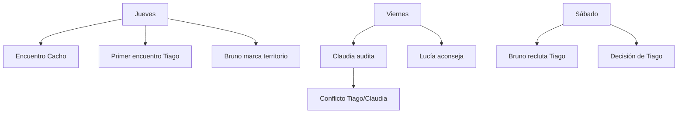

# Corrección Integral de "Un Día Más" - Plan de Implementación

> **For Claude:** REQUIRED SUB-SKILL: Use superpowers:executing-plans to implement this plan task-by-task.

**Goal:** Corregir todas las incongruencias críticas, implementar contenido faltante, y actualizar documentación para que el juego sea completamente jugable de lunes a domingo.

**Architecture:** El juego usa Ink (Inkle Studios) con patrón de tunnels modulares. Los personajes viven en `personajes/`, las ubicaciones en `ubicaciones/`, los días en `dias/`, y las mecánicas en `mecanicas/`. El tono narrativo es oraciones cortas, puntuadas, con silencios significativos. Uruguayismos obligatorios.

**Tech Stack:** Ink scripting language, inklecate compiler, JavaScript web runtime

**Modelo recomendado por tarea:**
- **Sonnet**: Tareas mecánicas, fragmentos cortos, funciones, documentación
- **Opus**: Escenas de Bruno, Claudia, cualquier contenido político/narrativo complejo

---

## FASE 1: BUGS CRÍTICOS (Bloquean gameplay)
*Estimación: 3-4 horas*

---

### Task 1: Eliminar duplicación de ixchel_fragmento_noche en jueves.ink

**Modelo:** Sonnet

**Files:**
- Modify: `prototype/ink/dias/jueves.ink` (buscar líneas ~937-942)

**Step 1: Leer el archivo y localizar la duplicación**

Buscar el patrón donde `ixchel_fragmento_noche` se llama dos veces y hay dos `* [Continuar]`.

**Step 2: Eliminar la segunda llamada duplicada**

El código correcto debe quedar así (una sola llamada condicional):

```ink
=== fragmento_comun_jueves ===

// Fragmento de Ixchel (si corresponde)
{fui_a_olla_jueves && vinculo != "sofia":
    -> ixchel_fragmento_noche ->
}

El barrio duerme.
Los problemas no.

* [Continuar] -> jueves_cliffhanger
```

Eliminar cualquier bloque duplicado que tenga otro `-> ixchel_fragmento_noche ->` o segundo `* [Continuar]`.

**Step 3: Compilar para verificar**

Run: `cd /home/victor/Exp/un-dia-mas && ./bin/inklecate prototype/ink/main.ink`
Expected: Sin errores de compilación

**Step 4: Commit**

```bash
git add prototype/ink/dias/jueves.ink
git commit -m "fix: remove duplicate ixchel_fragmento_noche call in jueves.ink

🤖 Generated with Claude Code
Co-Authored-By: Claude <noreply@anthropic.com>"
```

---

### Task 2: Crear los 12 fragmentos nocturnos faltantes

**Modelo:** Sonnet (con guía de tono)

**Files:**
- Modify: `prototype/ink/fragmentos/fragmentos.ink`

**Contexto de tono:** Los fragmentos son ventanas de 50-100 palabras. El jugador observa, no actúa. Oraciones cortas. Silencios. El fragmento muestra UN momento, UNA perspectiva.

**Step 1: Agregar fragmento_sofia_cocina**

```ink
// ============================================
// FRAGMENTOS FALTANTES - VIERNES/SABADO/DOMINGO
// ============================================

=== fragmento_sofia_cocina ===
// Sofía sola en la cocina de la olla, después de que todos se fueron

Sofía limpia la olla vacía.
Sus manos tiemblan un poco.

No es el cansancio.
Es saber que mañana hay que volver a empezar.

Nico y Lupe duermen en casa de Elena.
Ella prefiere que no la vean así.

Guarda los cucharones.
Apaga la luz.
Sale al frío.

Mañana será otro día.
Tiene que serlo.

->->
```

**Step 2: Agregar fragmento_marcos_insomnio**

```ink
=== fragmento_marcos_insomnio ===
// Marcos despierto a las 3am, mirando el techo

Marcos no duerme.
El techo tiene una mancha de humedad que parece un mapa.

Piensa en Lucía. En Martín.
En las decisiones que los alejaron.

El celular tiene un mensaje sin leer.
De hace tres días.

No lo va a contestar.
No sabe qué decir.

El insomnio de los que perdieron la fe.
Y no saben en qué creer ahora.

->->
```

**Step 3: Agregar fragmento_sofia_asamblea**

```ink
=== fragmento_sofia_asamblea ===
// Después de la asamblea, Sofía organiza los papeles

La asamblea terminó hace horas.
Sofía ordena las sillas.

Alguien dijo algo importante hoy.
No recuerda quién.

Pero algo cambió.
Lo sintió en el aire.

Quizás mañana sea diferente.
Quizás no.

Pero hoy, por primera vez en semanas,
no se siente sola empujando.

->->
```

**Step 4: Agregar fragmento_elena_recuerdo**

```ink
=== fragmento_elena_recuerdo ===
// Elena mira fotos viejas

Elena saca la caja de fotos.
Las mismas de siempre.

La Chola joven. La fábrica. La marcha del 83.

"Mirá lo que éramos", dice al aire.

Afuera, el barrio duerme.
Adentro, los recuerdos no.

Guarda la caja.
Se toma el té frío.

Mañana hay que cocinar.
El presente no espera.

->->
```

**Step 5: Agregar fragmento_diego_llamada**

```ink
=== fragmento_diego_llamada ===
// Diego intenta llamar a Venezuela

Diego marca el número.
Espera.
Buzón de voz.

"Mamá, soy yo. Estoy bien. El trabajo... está bien."

Mentira.
Pero no puede decir la verdad a 4000 kilómetros.

Corta.
Mira el saldo del celular.
Dos pesos.

Mañana es otro día.
Y hay que seguir mandando plata.
Aunque no haya.

->->
```

**Step 6: Agregar fragmento_marcos_balcon**

```ink
=== fragmento_marcos_balcon ===
// Marcos fuma en el balcón

Marcos fuma en el balcón.
El único vicio que le queda.

Mira las luces del barrio.
Antes conocía cada ventana.

Ahora son todas iguales.
Gente que no duerme.
Gente que no puede.

El humo se pierde en el frío.
Como todo lo demás.

->->
```

**Step 7: Agregar fragmento_sofia_pibes**

```ink
=== fragmento_sofia_pibes ===
// Sofía con Nico y Lupe

Nico pregunta por qué mamá llega tan tarde.
Lupe ya se durmió.

"Porque hay gente que tiene hambre, mi amor."

"¿Y nosotros?"

"Nosotros tenemos."

Nico asiente.
No pregunta más.

Sofía lo tapa.
Le besa la frente.

Por esto.
Por ellos.
Por eso sigue.

->->
```

**Step 8: Agregar fragmento_elena_banco**

```ink
=== fragmento_elena_banco ===
// Elena en el banco de la plaza, sola

Elena se sienta en el banco de la plaza.
El mismo de siempre.

Antes venía con la Chola.
Ahora viene sola.

Los pibes pasan. No la ven.
Los perros sí.

Uno se acerca. Le lame la mano.

"Vos me entendés", dice Elena.

El perro mueve la cola.
Es suficiente.

->->
```

**Step 9: Agregar fragmento_diego_mate**

```ink
=== fragmento_diego_mate ===
// Diego prepara mate solo

Diego prepara mate.
El ritual de allá, trasplantado acá.

En Venezuela era café.
Acá aprendió el mate.

Adaptarse o morir.

El termo está tibio.
Como todo lo demás.

Pero es suyo.
Este momento, solo.

Mañana vuelve el ruido.
Ahora, silencio.

->->
```

**Step 10: Agregar fragmento_marcos_musica**

```ink
=== fragmento_marcos_musica ===
// Marcos escucha un disco viejo

Marcos pone un disco.
Zitarrosa. El de siempre.

"Adagio en mi país..."

La voz le recuerda a su viejo.
A las reuniones en el fondo.
A cuando todo parecía posible.

La aguja salta.
El disco está rayado.

Como la memoria.
Como la esperanza.

->->
```

**Step 11: Agregar fragmento_juan_cena**

```ink
=== fragmento_juan_cena ===
// Juan cena con Laura

Juan cena con Laura.
Milanesas. Las de siempre.

Ella pregunta cómo estuvo el día.
Él dice "bien".

Mentira.
Pero no quiere preocuparla.

Come en silencio.
Laura lo mira.
Sabe que algo pasa.
No pregunta.

El matrimonio es también
los silencios que no se rompen.

->->
```

**Step 12: Agregar fragmento_ixchel_altar**

```ink
=== fragmento_ixchel_altar ===
// Ixchel ante su pequeño altar

Ixchel enciende la vela.
El altarcito tiene la foto de su abuela.
Un tejido. Flores secas.

"Ati't, kab'ij nub'e."
Abuela, dame fuerzas.

El K'iche' en la boca
como un hilo que la une a casa.

Montevideo duerme afuera.
Quetzaltenango vive adentro.

Dos mundos.
Ella, el puente.

->->
```

**Step 13: Compilar para verificar**

Run: `cd /home/victor/Exp/un-dia-mas && ./bin/inklecate prototype/ink/main.ink`
Expected: Sin errores de compilación

**Step 14: Commit**

```bash
git add prototype/ink/fragmentos/fragmentos.ink
git commit -m "feat: add 12 missing nocturnal fragments

Adds:
- fragmento_sofia_cocina, fragmento_marcos_insomnio
- fragmento_sofia_asamblea, fragmento_elena_recuerdo
- fragmento_diego_llamada, fragmento_marcos_balcon
- fragmento_sofia_pibes, fragmento_elena_banco
- fragmento_diego_mate, fragmento_marcos_musica
- fragmento_juan_cena, fragmento_ixchel_altar

🤖 Generated with Claude Code
Co-Authored-By: Claude <noreply@anthropic.com>"
```

---

### Task 3: Corregir variable scope `despertar` en casa.ink

**Modelo:** Sonnet

**Files:**
- Modify: `prototype/ink/ubicaciones/casa.ink` (línea ~194)

**Step 1: Localizar la declaración incorrecta**

Buscar: `~ temp despertar = chequeo_mental(0, 3)`

**Step 2: Cambiar de temp a asignación directa**

El código debe quedar:

```ink
~ despertar = chequeo_mental(0, 3)
```

O si `despertar` no está declarada globalmente, agregar a `variables.ink`:

```ink
VAR despertar = 0
```

**Step 3: Compilar para verificar**

Run: `cd /home/victor/Exp/un-dia-mas && ./bin/inklecate prototype/ink/main.ink`

**Step 4: Commit**

```bash
git add prototype/ink/ubicaciones/casa.ink
git commit -m "fix: correct variable scope for 'despertar' in casa.ink

🤖 Generated with Claude Code
Co-Authored-By: Claude <noreply@anthropic.com>"
```

---

### Task 4: Asignar participe_asamblea = true donde corresponde

**Modelo:** Sonnet

**Files:**
- Modify: `prototype/ink/dias/sabado.ink` (buscar `olla_asamblea_fin` o escena de asamblea)

**Step 1: Localizar la escena de asamblea en sabado.ink**

Buscar el knot donde termina la asamblea del sábado.

**Step 2: Agregar la asignación**

Después de que el protagonista participe en la asamblea, agregar:

```ink
~ participe_asamblea = true
```

**Step 3: Verificar que la variable está declarada en variables.ink**

Buscar `VAR participe_asamblea`. Si no existe, agregarla:

```ink
VAR participe_asamblea = false
```

**Step 4: Compilar y commit**

```bash
git add prototype/ink/dias/sabado.ink prototype/ink/variables.ink
git commit -m "fix: assign participe_asamblea = true after assembly scene

🤖 Generated with Claude Code
Co-Authored-By: Claude <noreply@anthropic.com>"
```

---

## FASE 2: MECÁNICAS Y SISTEMA DE IDEAS
*Estimación: 2-3 horas*

---

### Task 5: Verificar que todas las funciones activar_* existen

**Modelo:** Sonnet

**Files:**
- Read: `prototype/ink/mecanicas/ideas.ink`
- Verify all `activar_*` functions are defined

**Step 1: Listar funciones requeridas**

Las funciones que deben existir son:
- `activar_tengo_tiempo()` ✓
- `activar_pedir_no_debilidad()` ✓
- `activar_hay_cosas_juntos()` ✓
- `activar_red_o_nada()` ✓
- `activar_quien_soy()` ✓
- `activar_esto_es_lo_que_hay()` ✓
- `activar_no_es_individual()` ✓
- `activar_antagonismo_clase()` ✓
- `activar_autonomia_posible()` ✓
- `activar_sabotaje_legitimo()` ✓

**Step 2: Verificar que están siendo llamadas desde personajes**

Grep en personajes/*.ink para verificar que se llaman correctamente.

**Step 3: Documentar resultado**

Si alguna falta, agregarla siguiendo el patrón existente.

**Step 4: Commit si hubo cambios**

---

### Task 6: Corregir aumentar_inercia() para usar ajustar()

**Modelo:** Sonnet

**Files:**
- Modify: `prototype/ink/mecanicas/recursos.ink`

**Step 1: Localizar la función aumentar_inercia**

Buscar: `=== function aumentar_inercia`

**Step 2: Modificar para usar ajustar()**

```ink
=== function aumentar_inercia(cantidad) ===
    ~ inercia = ajustar(inercia + cantidad, 0, 10)
    { inercia >= 8:
        # STAT_THRESHOLD:inercia,critical
        // Notificación de inercia crítica
    }
    { inercia >= 5 && inercia < 8:
        # STAT_THRESHOLD:inercia,high
    }
```

**Step 3: Hacer lo mismo con disminuir_inercia**

```ink
=== function disminuir_inercia(cantidad) ===
    ~ inercia = ajustar(inercia - cantidad, 0, 10)
```

**Step 4: Compilar y commit**

---

## FASE 3: DESARROLLO DE PERSONAJES ANTAGONISTAS
*Estimación: 8-12 horas*

---

### Task 7: Expandir bruno.ink - La Visita Completa

**Modelo:** Opus (contenido político sensible)

**Files:**
- Modify: `prototype/ink/personajes/bruno.ink`

**Step 1: Agregar escena de llegada al barrio**

```ink
=== bruno_la_visita ===
// Escena Jueves tarde: Bruno marca territorio

La camioneta negra aparece en la esquina.
Motor encendido. Vidrios polarizados.

Los pibes de la vereda se alejan.
Saben quién es.

El vidrio baja. Solo un poco.

"Buenas tardes."

No es un saludo.
Es un aviso.

Bruno mira la fila de la olla.
Cuenta cabezas.
Toma nota mental.

El vidrio sube.
La camioneta se va.

Pero el mensaje quedó.
Él estuvo acá.
Está mirando.

->->
```

**Step 2: Agregar escena de confrontación con Sofía**

```ink
=== bruno_confronta_sofia ===
// Escena Viernes: El conflicto ideológico

Bruno se baja de la camioneta.
Camina hacia Sofía.

"Vecina. ¿Cuántos platos hoy?"

Sofía no lo mira.
Sigue revolviendo.

"Los que hagan falta."

Bruno sonríe.
"Eso es bonito. Pero no es sustentable."

Se acerca más.
"Ustedes dan pescado. Yo enseño a pescar.
Con disciplina. Con orden. Con Dios."

Sofía suelta el cucharón.
Lo mira.

"Tu Dios no lava los platos, Bruno.
Ni pela las papas.
Acá laburamos todos."

Bruno retrocede.
Pero sigue sonriendo.

"Vamos a ver cuánto dura esto sin orden."

Se sube a la camioneta.
Se va.

~ bruno_tension += 2

->->
```

**Step 3: Agregar la oferta directa al protagonista**

```ink
=== bruno_oferta_protagonista ===
// Escena Sábado/Domingo: Si inercia >= 7

{inercia >= 7:
    Bruno te encuentra solo.

    "Te vi estos días. Andás perdido."

    Te pone la mano en el hombro.
    Firme. Como un policía.

    "En mi chacra hay trabajo de verdad.
    Orden. Techo. Comida.
    Y un propósito."

    * [Rechazarlo con fuerza.]
        Sacás su mano de tu hombro.

        "No necesito tu orden, Bruno.
        Necesito trabajo. No un jefe que rece."

        Bruno achica los ojos.
        "Todos necesitan orden. Algunos lo entienden antes.
        Otros... después."

        ~ disminuir_inercia(2)
        ~ subir_dignidad(2)
        ->->

    * [Escuchar más.]
        "¿Qué hay que hacer?"

        "Trabajar. Obedecer. Creer.
        No es difícil si dejás el orgullo afuera."

        Te da una tarjeta.
        "Pensalo. Pero no pienses mucho."

        ~ aumentar_inercia(2)
        ~ unlock_idea(idea_orden_autoritario)
        ->->

    * [Quedarte callado.]
        No decís nada.

        Bruno espera.
        Después se ríe.

        "El silencio también es respuesta.
        Ya vas a venir."

        Se va.
        ->->
}
->->
```

**Step 4: Compilar y commit**

```bash
git add prototype/ink/personajes/bruno.ink
git commit -m "feat: expand Bruno character with full antagonist arc

Adds:
- bruno_la_visita: territory marking scene
- bruno_confronta_sofia: ideological confrontation
- bruno_oferta_protagonista: direct temptation based on inercia

🤖 Generated with Claude Code
Co-Authored-By: Claude <noreply@anthropic.com>"
```

---

### Task 8: Expandir claudia.ink - La Violencia Administrativa

**Modelo:** Opus (contenido político sensible)

**Files:**
- Modify: `prototype/ink/personajes/claudia.ink`

**Step 1: Agregar escena de llegada**

```ink
=== claudia_llegada ===
// Escena Viernes mañana: Claudia aparece

Un auto gris estaciona frente a la olla.
Matrícula oficial.

Baja una mujer.
Traje. Carpeta. Cara de nada.

Sofía se tensa.
"La auditora."

Claudia camina como quien revisa una obra.
Toca las paredes. Mira los cajones.
Anota.

No saluda a nadie.
Nadie existe para ella.
Solo los números.

->->
```

**Step 2: Agregar escena del tupper (conflicto con Tiago)**

Ya existe `tiago_conflicto_comida` - verificar que se integra bien.

**Step 3: Agregar la amenaza velada**

```ink
=== claudia_amenaza_final ===
// Escena Viernes tarde: El ultimátum

Claudia cierra la carpeta.
Te mira.
Mira a Sofía.

"Voy a ser clara."

Saca un papel.
Sello oficial.

"Este lugar opera sin habilitación municipal.
Sin control bromatológico.
Sin registro de beneficiarios."

Sofía abre la boca.
Claudia la corta.

"Sé lo que van a decir. Que es solidaridad.
Que la gente tiene hambre.
Que el Estado no llega."

Guarda el papel.

"El Estado soy yo.
Y estoy llegando."

* [Confrontarla.]
    "El Estado también somos nosotros, Claudia.
    O te olvidaste de quién paga tu sueldo."

    Claudia se ríe.
    Una risa fría.

    "Ustedes no pagan nada.
    Por eso estoy acá."

    ~ claudia_hostilidad += 2
    ~ subir_dignidad(1)
    ->->

* [Intentar negociar.]
    "¿Qué necesitás para dejarnos trabajar?"

    "La lista. Nombre, cédula, firma.
    De cada persona que comió acá esta semana."

    Sofía niega con la cabeza.

    "Si me dan la lista, les doy una semana más.
    Si no..."

    Deja la frase sin terminar.

    ~ olla_en_crisis = true
    ->->

* [No decir nada.]
    Dejás que Sofía hable.
    No es tu pelea.

    Todavía.

    ->->
```

**Step 4: Agregar el fragmento nocturno de Claudia**

```ink
=== fragmento_claudia_oficina ===
// Claudia en su oficina, de noche

Claudia revisa planillas.
Números que no cierran.
Raciones que no cuadran.

Su jefe la presiona.
"Ordená esas ollas o las cerramos."

Ella sabe lo que significa cerrar.
Gente sin comer.

Pero no es su problema.
Su problema es el Excel.

Apaga la computadora.
Se va a su casa.

Mañana sigue.
Siempre sigue.

->->
```

**Step 5: Compilar y commit**

```bash
git add prototype/ink/personajes/claudia.ink
git commit -m "feat: expand Claudia character with full administrative violence arc

Adds:
- claudia_llegada: inspection arrival
- claudia_amenaza_final: ultimatum scene
- fragmento_claudia_oficina: nocturnal fragment showing her perspective

🤖 Generated with Claude Code
Co-Authored-By: Claude <noreply@anthropic.com>"
```

---

### Task 9: Expandir lucia.ink - La Sindicalista

**Modelo:** Sonnet

**Files:**
- Modify: `prototype/ink/personajes/lucia.ink`

**Step 1: Agregar escena de almuerzo en la oficina**

```ink
=== lucia_almuerzo_oficina ===
// Escena Martes: Almuerzo tenso

Lucía se sienta a tu lado en el comedor.
Abre un tupper. Arroz con verduras.

"¿Viste la cara del jefe hoy?"

* [Preguntar qué vio.]
    "¿Qué pasa?"

    Lucía baja la voz.
    "Están preparando la lista.
    Los que sobran."

    "¿Y vos?"

    "Yo ya me peleé con todos.
    Si me echan, me echan peleando."

    ~ lucia_relacion += 1
    ->->

* [Cambiar de tema.]
    "Prefiero no pensar en eso."

    Lucía asiente.
    "Entiendo.
    Pero pensar es lo único que nos queda."

    ->->
```

**Step 2: Agregar escena post-despido**

```ink
=== lucia_post_despido ===
// Escena Jueves: Si la buscás

Lucía atiende el teléfono rápido.

"Me enteré. Hijos de puta."

No te deja hablar.

"Escuchame. No te quedes en casa.
Mañana a las 9 hay una reunión en el sindicato.
No por vos. Por todos los que vienen después."

* [Decir que vas a ir.]
    "Voy."

    "Bien. Y traete papeles.
    Recibos, mails, lo que tengas."

    ~ lucia_consejo_sindical = true
    ~ disminuir_inercia(1)
    ~ unlock_idea(idea_organizacion_real)
    ->->

* [Decir que no tenés fuerzas.]
    "No sé si puedo, Lucía."

    Silencio.

    "Nadie puede solo.
    Por eso nos juntamos."

    Corta.

    ~ aumentar_inercia(1)
    ->->
```

**Step 3: Agregar fragmento nocturno**

```ink
=== fragmento_lucia_numeros ===
// Lucía hace números de noche

Lucía tiene la calculadora en la mano.
Papeles por todos lados.

Suma lo que la empresa se ahorró
echándolos a todos.

Tres sueldos.
Aguinaldo proporcional.
Vacaciones.

"Un millón doscientos."

Por cabeza.

Apaga la luz.
Mañana hay que pelear.

->->
```

**Step 4: Compilar y commit**

```bash
git add prototype/ink/personajes/lucia.ink
git commit -m "feat: expand Lucía character with union organizer arc

🤖 Generated with Claude Code
Co-Authored-By: Claude <noreply@anthropic.com>"
```

---

### Task 10: Expandir tiago.ink - El Pibe

**Modelo:** Sonnet

**Files:**
- Modify: `prototype/ink/personajes/tiago.ink`

**Step 1: Agregar escena de confianza ganada**

```ink
=== tiago_confianza ===
// Escena Viernes/Sábado: Si tiago_confianza >= 2

Tiago se sienta a tu lado.
No dice nada.

Después de un rato:

"Mi vieja está internada.
En el Vilardebó."

No te mira.

"No voy a visitarla.
No puedo."

* [Escuchar en silencio.]
    No decís nada.

    A veces el silencio es el único respeto.

    Tiago asiente.
    "Gracias por no decir nada."

    ~ tiago_confianza += 2
    ->->

* [Decir algo de apoyo.]
    "Está bien no poder."

    Tiago te mira.
    Por primera vez, sin desafío.

    "¿Vos creés?"

    "Sí."

    ~ tiago_confianza += 1
    ->->
```

**Step 2: Agregar la decisión crucial**

```ink
=== tiago_decision_final ===
// Escena Sábado/Domingo: La encrucijada

{tiago_confianza >= 3:
    Tiago te busca.

    "Bruno me ofreció llevarme a la chacra.
    Zapatillas. Comida. Un lugar."

    Te mira.

    "¿Qué hago?"

    * [Decirle que se quede.]
        "Quedate, Tiago.
        Acá también hay lugar.
        No es una chacra, pero es real."

        Tiago piensa.

        "¿Y si no alcanza?"

        "Vamos a hacer que alcance.
        Pero juntos."

        Tiago asiente.

        ~ tiago_se_queda = true
        ~ subir_llama(2)
        ~ subir_conexion(1)
        ->->

    * [Dejarlo decidir.]
        "No sé, Tiago.
        Es tu vida."

        Tiago baja la cabeza.

        "Nadie me dijo eso nunca."

        Se queda pensando.
        El resultado depende de la llama del barrio.

        {llama >= 6:
            "Me quedo. Por ahora."
            ~ tiago_se_queda = true
        - else:
            "Voy a ir. A ver qué onda."
            ~ tiago_captado_por_bruno = true
            ~ bajar_llama(2)
        }
        ->->
- else:
    // Si no tiene confianza, no te consulta
    ->->
}
```

**Step 3: Agregar fragmento nocturno**

```ink
=== fragmento_tiago_techo ===
// Tiago en un techo, mirando el barrio

Tiago está en el techo de la olla.
Se subió por la canaleta.

Desde arriba, el barrio parece distinto.
Más ordenado.
Menos caótico.

Piensa en la chacra de Bruno.
Piensa en la olla.
Piensa en la calle.

Tres opciones.
Ninguna buena.

Se queda mirando las estrellas.
Las mismas de siempre.
Las únicas que no cambian.

->->
```

**Step 4: Compilar y commit**

```bash
git add prototype/ink/personajes/tiago.ink
git commit -m "feat: expand Tiago character with trust and decision arc

🤖 Generated with Claude Code
Co-Authored-By: Claude <noreply@anthropic.com>"
```

---

### Task 11: Expandir cacho.ink - El Iluso

**Modelo:** Sonnet

**Files:**
- Modify: `prototype/ink/personajes/cacho.ink`

**Step 1: Agregar escena de la casa ruinosa**

```ink
=== cacho_casa ===
// Escena Jueves: La casa de Cacho

Cacho te invita a pasar.

"Tengo algo que mostrarte."

La casa huele a humedad.
Revoque caído. Cables sueltos.
Pero Cacho camina como si fuera un palacio.

"Esto va a ser un emprendimiento, vecino.
Coworking. O Airbnb. Depende del mercado."

Señala una habitación llena de cajas.
"Stock. Inversión a futuro."

Abrís una caja.
Decodificadores viejos.

"Esos se arreglan y se venden como nuevos.
Es cuestión de actitud."

* [Seguirle el juego.]
    "Tenés razón, Cacho. Es cuestión de actitud."

    Sonríe.
    Por un segundo, parece feliz.

    "¡Eso! Vos entendés."

    ~ cacho_deuda += 1
    ->->

* [Ser honesto.]
    "Cacho, esto no es un negocio.
    Es una casa que se cae."

    Se queda callado.

    Después:
    "Ya lo sé.
    Pero si no me lo creo...
    ¿qué me queda?"

    Por un momento, ves al hombre detrás del personaje.

    ~ cacho_momento_real = true
    ->->
```

**Step 2: Agregar escena de crisis (si la olla cierra)**

```ink
=== cacho_sin_olla ===
// Escena Sábado: Si la olla cerró

Cacho está sentado en la vereda.
Ya no tiene el discurso de siempre.

"¿Cómo puede ser?"

Te mira.

"Yo les decía que esto no era sustentable.
Que había que profesionalizar.
Pero nadie me escuchaba."

Siempre es culpa de otros.
Nunca suya.

* [No decir nada.]
    Te sentás a su lado.

    El silencio es más honesto que cualquier respuesta.

    ->->

* [Confrontarlo.]
    "Vos tampoco hiciste nada, Cacho.
    Solo hablaste."

    Se queda mudo.

    "Tenés razón.
    Pero hablar es lo único que sé."

    ~ cacho_momento_real = true
    ->->
```

**Step 3: Agregar fragmento nocturno**

```ink
=== fragmento_cacho_casa ===
// Cacho solo en su casa

Cacho cuenta las monedas en el frasco.
No alcanzan para nada.

Mira la foto de su madre.
Ella sí trabajó toda la vida.
Él no heredó eso.
Solo la casa.

"Mañana va a ser distinto."

Se lo dice todas las noches.
Todas las noches es mentira.

Pero la mentira lo deja dormir.
Es suficiente.

->->
```

**Step 4: Compilar y commit**

```bash
git add prototype/ink/personajes/cacho.ink
git commit -m "feat: expand Cacho character with delusion and reality arc

🤖 Generated with Claude Code
Co-Authored-By: Claude <noreply@anthropic.com>"
```

---

## FASE 4: INTEGRACIÓN DE PERSONAJES EN DÍAS
*Estimación: 4-6 horas*

---

### Task 12: Integrar personajes Fase 2 en jueves.ink

**Modelo:** Sonnet

**Files:**
- Modify: `prototype/ink/dias/jueves.ink`

**Step 1: Agregar encuentro con Cacho**

En la sección de la mañana, después de salir de casa:

```ink
// Encuentro aleatorio con Cacho (1 en 3 probabilidad)
{RANDOM(1,3) == 1:
    -> cacho_oferta_negocio ->
}
```

**Step 2: Agregar primera aparición de Bruno**

En la sección de la tarde, si el protagonista va a la olla:

```ink
// Bruno aparece si vas a la olla
{fui_a_olla_jueves:
    -> bruno_la_visita ->
}
```

**Step 3: Agregar encuentro con Tiago**

Ya existe referencia a `tiago_primer_encuentro` en olla.ink. Verificar que se llama.

**Step 4: Compilar y commit**

---

### Task 13: Integrar personajes Fase 2 en viernes.ink

**Modelo:** Sonnet

**Files:**
- Modify: `prototype/ink/dias/viernes.ink`

**Step 1: Agregar escena de Claudia**

En la sección de la olla del viernes:

```ink
// Claudia llega a la olla
-> claudia_llegada ->

// La auditoría central
-> claudia_la_auditoria ->
```

**Step 2: Agregar conflicto Tiago/Claudia**

```ink
// Conflicto del tupper
{tiago_confianza >= 1:
    -> tiago_conflicto_comida ->
}
```

**Step 3: Agregar Lucía si el protagonista la busca**

En opciones de la mañana:

```ink
* [Llamar a Lucía]
    -> lucia_post_despido ->
```

**Step 4: Compilar y commit**

---

### Task 14: Integrar personajes Fase 2 en sabado.ink

**Modelo:** Sonnet

**Files:**
- Modify: `prototype/ink/dias/sabado.ink`

**Step 1: Agregar escena de Bruno reclutando a Tiago**

Si la olla cerró o está en crisis:

```ink
{olla_en_crisis || olla_cerro_viernes:
    -> bruno_recluta_tiago ->
}
```

**Step 2: Agregar decisión de Tiago**

Si tiene confianza:

```ink
{tiago_confianza >= 3:
    -> tiago_decision_final ->
}
```

**Step 3: Agregar Cacho en la fila**

```ink
// Cacho aparece en la fila
{not olla_en_crisis:
    -> cacho_en_la_fila ->
}
```

**Step 4: Agregar oferta de Bruno al protagonista**

```ink
{inercia >= 7:
    -> bruno_oferta_protagonista ->
}
```

**Step 5: Compilar y commit**

---

## FASE 5: ACTUALIZACIÓN DE DOCUMENTACIÓN
*Estimación: 3-4 horas*

---

### Task 15: Actualizar MASTER-PLAN.md - Reemplazar salud_mental por inercia

**Modelo:** Sonnet

**Files:**
- Modify: `docs/MASTER-PLAN.md`

**Step 1: Buscar y reemplazar**

Buscar todas las instancias de `salud_mental` y reemplazar por `inercia`.

Actualizar la descripción:
- `salud_mental` era "baja = malo"
- `inercia` es "alta = malo" (la fuerza que te mantiene quieto)

**Step 2: Agregar sección de NPCs Fase 2**

Agregar después de la lista de NPCs principales:

```markdown
### NPCs Fase 2 (Antagonistas y Secundarios)

| Personaje | Rol | Archivo |
|-----------|-----|---------|
| Lucía | Sindicalista pragmática, compañera de trabajo | personajes/lucia.ink |
| Tiago | Adolescente de logística, futuro en riesgo | personajes/tiago.ink |
| Cacho | "Emprendedor" iluso, pensamiento mágico | personajes/cacho.ink |
| Bruno | Líder teocrático, antagonista territorial | personajes/bruno.ink |
| Claudia | Auditora estatal, violencia administrativa | personajes/claudia.ink |
```

**Step 3: Commit**

---

### Task 16: Actualizar narrative-map.md - Triggers de finales

**Modelo:** Sonnet

**Files:**
- Modify: `docs/design/narrative-map.md`

**Step 1: Buscar todos los triggers con salud_mental**

Reemplazar por lógica de inercia (recordar que es inverso):
- `salud_mental <= 2` → `inercia >= 8`
- `salud_mental >= 4` → `inercia <= 6`

**Step 2: Actualizar rangos de relaciones**

Cambiar de 0-10 a 0-5 donde corresponda.

**Step 3: Agregar NPCs Fase 2 a la sección de personajes**

**Step 4: Commit**

---

### Task 17: Actualizar flowcharts.md

**Modelo:** Sonnet

**Files:**
- Modify: `docs/design/flowcharts.md`

**Step 1: Actualizar diagramas de finales**

Reemplazar `salud_mental` por `inercia` en todos los Mermaid diagrams.

**Step 2: Agregar flujo de personajes Fase 2**



**Step 3: Commit**

---

### Task 18: Crear perfiles faltantes de variables

**Modelo:** Sonnet

**Files:**
- Modify: `prototype/ink/variables.ink`

**Step 1: Verificar que todas las variables de Fase 2 existen**

```ink
// === PERSONAJES FASE 2 ===

// Lucía
VAR lucia_relacion = 0
VAR lucia_consejo_sindical = false

// Tiago
VAR tiago_confianza = 0
VAR tiago_estado = "presente"
VAR tiago_se_queda = false
VAR tiago_captado_por_bruno = false

// Cacho
VAR cacho_deuda = 0
VAR cacho_momento_real = false

// Bruno
VAR bruno_tension = 0

// Claudia
VAR claudia_hostilidad = 0
VAR lista_entregada = false
```

**Step 2: Compilar y commit**

---

## FASE 6: VERIFICACIÓN FINAL
*Estimación: 2-3 horas*

---

### Task 19: Compilación completa del juego

**Modelo:** Sonnet

**Files:**
- All .ink files

**Step 1: Compilar**

```bash
cd /home/victor/Exp/un-dia-mas
./bin/inklecate prototype/ink/main.ink
```

**Step 2: Verificar que no hay errores**

Si hay errores, corregirlos uno por uno.

**Step 3: Generar JSON para web**

```bash
./bin/inklecate -o prototype/web/un_dia_mas.json prototype/ink/main.ink
echo "var storyContent = $(cat prototype/web/un_dia_mas.json);" > prototype/web/un_dia_mas.js
```

---

### Task 20: Test de rutas críticas

**Modelo:** Sonnet

**Step 1: Ejecutar el juego en web**

Abrir `prototype/web/index.html` en navegador.

**Step 2: Testear ruta mínima**

- Lunes → Martes → Miércoles (despido) → Jueves → Viernes → Sábado → Domingo
- Verificar que no hay crashes

**Step 3: Testear fragmentos nocturnos**

- Verificar que las noches de viernes, sábado y domingo muestran fragmentos

**Step 4: Testear personajes Fase 2**

- Encontrar a Cacho en jueves
- Ver a Bruno en la olla
- Interactuar con Claudia en viernes
- Ver decisión de Tiago en sábado

---

### Task 21: Commit final y tag de versión

**Step 1: Git status y add**

```bash
git status
git add -A
```

**Step 2: Commit comprensivo**

```bash
git commit -m "feat: complete Phase 2 implementation

- Add 12 nocturnal fragments
- Expand Bruno, Claudia, Lucía, Tiago, Cacho characters
- Integrate Phase 2 characters into days
- Fix critical bugs (duplicate ixchel, variable scope, participe_asamblea)
- Update documentation (salud_mental → inercia)
- Add all Phase 2 variables

🤖 Generated with Claude Code
Co-Authored-By: Claude <noreply@anthropic.com>"
```

**Step 3: Tag de versión**

```bash
git tag -a v1.0.0 -m "Version 1.0 - Complete gameplay from Monday to Sunday"
```

---

## RESUMEN DE ESTIMACIONES

| Fase | Tareas | Horas | Modelo |
|------|--------|-------|--------|
| 1: Bugs Críticos | 4 | 3-4h | Sonnet |
| 2: Mecánicas | 2 | 2-3h | Sonnet |
| 3: Personajes Antagonistas | 5 | 8-12h | Opus (Bruno, Claudia) / Sonnet (otros) |
| 4: Integración | 3 | 4-6h | Sonnet |
| 5: Documentación | 4 | 3-4h | Sonnet |
| 6: Verificación | 3 | 2-3h | Sonnet |
| **TOTAL** | **21** | **22-32h** | - |

---

## NOTAS DE TONO NARRATIVO

Para todas las tareas de escritura, recordar:

1. **Oraciones cortas.** Puntuadas. Silencios.
2. **Uruguayismos:** laburo, bondi, pibe, guita, morfar, afanar
3. **Sin didactismo:** Mostrar, no explicar. El jugador saca conclusiones.
4. **Contradicciones humanas:** Nadie es 100% bueno o malo.
5. **Lo político es personal:** La precariedad no es abstracta, tiene cara.
6. **Esperanza sin ingenuidad:** El final puede ser duro, pero hay dignidad en la lucha.

---

*Plan generado: 2026-01-28*
*Proyecto: Un Día Más*
*Versión objetivo: 1.0.0*
